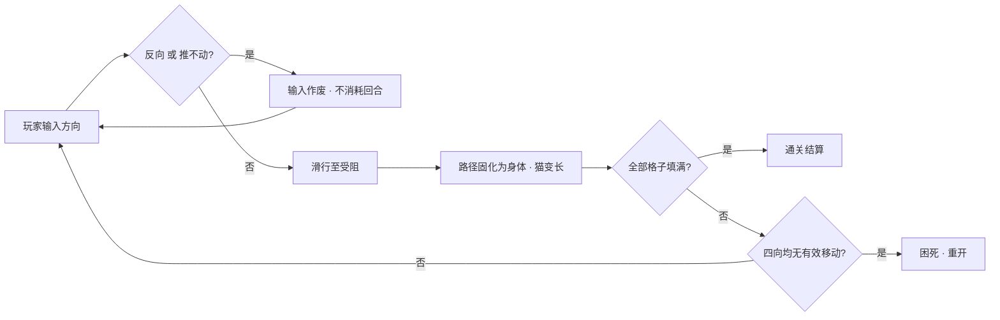
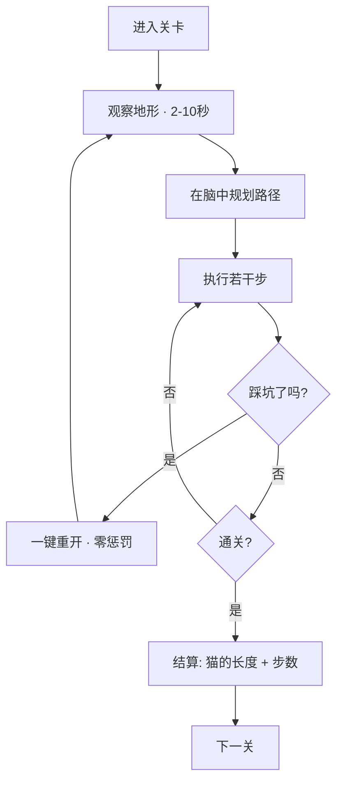

# Longcat · 核心循环与关卡结构

## 一、秒级循环（Single-Move Loop）

一次输入内部发生了什么：



**设计要点**：`C`（输入作废）这个分支极其重要——它让玩家的"试探"零成本。玩家可以在脑子里过不去时，用手指去试，试错不惩罚。

---

## 二、关级循环（Level Loop）



### 单次会话节奏

| 阶段 | 时长 | 玩家状态 |
|------|------|---------|
| 观察 | 2–10 秒 | 扫描地形，找"死角" |
| 规划 | 5–30 秒 | 脑内推演路径 |
| 执行 | 5–20 秒 | 连续输入，看着猫变长 |
| 结算 | 2–3 秒 | 欣赏猫的长度 |
| **单关总计** | **30 秒 – 2 分钟** | — |

**这个节奏是碎片场景的完美尺寸**，也是微信小游戏最舒服的形态。

---

## 三、局外循环（Meta Loop）

Longcat 的局外循环**极其稀薄**——这是它最大的特点，也是最大的弱点：

```
选关 → 通关 → 下一关 → …… → 通关全部 → 结束
```

| 局外元素 | 是否存在 | 评价 |
|---------|---------|------|
| 关卡选择/进度表 | ✅ 有 | 唯一的结构性元素 |
| 星级 / 评分 | `[推断]` 有（步数或长度） | 提供重玩动机 |
| 成长 / 养成 | ❌ 无 | 不接住卡关玩家 |
| 货币 / 解锁 | ❌ 无 | 无节奏调控手段 |
| 社交 / 排行 | ❌ 无（Poki 版） | 无病毒传播点 |
| 收集 / 皮肤 | `[推断]` App 版可能有 | 未确认 |

**结论**：Longcat 把复杂度全部压在关卡内容上，局外几乎裸奔。
**对新项目的启示**：这是可以加的空白区——**元层（roguelike 能力、皮肤、每日挑战、排行榜）是最直接的差异化切入点**。

---

## 四、难度的两种手段

Longcat 用两个完全不同的旋钮调难度，理解它们的区别对自建关卡至关重要：

### 旋钮 A：路径长度（Length）

增加需要填充的格子数 → 步数变多。

```
第 1 关  5 步  →  第 33 关 21 步  →  第 50 关 21 步
```

特点：**线性、可预期、容易生成**。但堆到后期边际收益递减——步数多了只是"烦"，不一定"难"。

### 旋钮 B：分支稀缺度（Branch Scarcity）

减少地形中的容错空间 → 走错一步就死。

```
第 14 关 14 步  →  第 15 关 8 步  （步数腰斩，难度不降反升）
第 40 关 12 步  →  第 41 关 17 步
第 46 关 13 步  →  第 47 关 12 步
```

特点：**非线性、难调、需要求解器验证**。这才是真正的"难度"。

### 对照表

| | 旋钮 A 长度 | 旋钮 B 分支稀缺度 |
|---|---|---|
| 玩家感受 | "这关好长" | "这关好刁" |
| 挫败感 | 低（慢慢推总会到） | 高（一步错全盘皆输） |
| 生成难度 | 容易（放大网格即可） | 难（需穷举验证） |
| 适用阶段 | 前中期建立信心 | 后期制造记忆点 |
| 关卡寿命 | 消耗快 | 印象深刻 |

**设计建议**：前期用 A 为主（建立"我在变强"的错觉），中期 A+B 混合，后期以 B 为主并**周期性插入短关卡作为节奏调剂**（如第 15 关、第 47 关）。

---

## 五、关卡的节奏编排

从 50 关步数分布（详见 `numbers/`）能反推出编排意图：

```
阶段        关卡      平均步数    编排意图
─────────────────────────────────────────────
教学期      1-10      8.3 步     建立规则直觉，几乎不设陷阱
爬坡期      11-20     10.9 步    引入分支陷阱，第 15 关插短关调剂
强化期      21-30     13.3 步    长度与陷阱并重
高压期      31-40     16.5 步    峰值第 33 关 21 步，第 40 关回落至 12 步
 Plateau    41-50     16.1 步    不再加长，改用结构复杂度收尾
                                 第 50 关 21 步封顶
```

**两个可复用的编排技巧**：

1. **回落式调剂**：高压期之后紧跟一个短关卡（第 40 关 12 步、第 47 关 12 步），让玩家"喘口气"。
   这不是偷懒，是**防止疲劳流失的阀门**。

2. **双峰封顶**：第 33 关和第 50 关都是 21 步。第 33 关是"中途 Boss"，第 50 关是"终关仪式感"——
   用同等步数但不同结构，制造"我又变强了但最终挑战仍在"的体验。

---

## 六、关卡的"可读性"设计

解谜游戏的关键不是"难"，是"玩家能看懂难在哪"。

Longcat 依赖三条可读性设计 `[推断]`：

| 设计 | 作用 |
|------|------|
| **体素方块墙** | 地形一目了然，无视觉噪音干扰判断 |
| **猫身填充高对比色** | 已填 vs 未填一眼可辨，剩余空间可视化 |
| **等距/俯视视角** | 全局可见，玩家能一眼扫完全图做规划 |

**反面教训**：如果新项目加入太多特效、动态元素或遮挡，会直接摧毁这类谜题的核心体验——
**空间解谜的前提是"全图可读"**。
