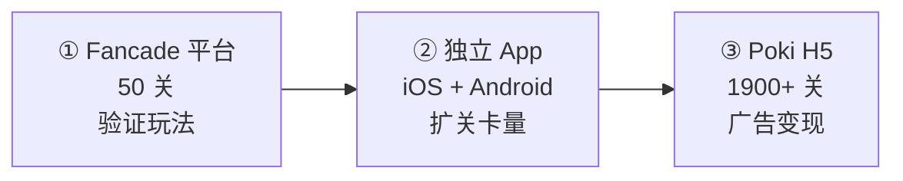

# Longcat · 产品化与商业化路径

## 一、三级跳跃路径（可复用的方法论）

Longcat 从"平台里一个小游戏"长成"1900 关的商业产品"，走了三步。**这条路径对小游戏开发者是标准范式**：

### 阶段对照表

| | ① UGC 平台 | ② 独立 App | ③ 网页分发 |
|---|---|---|---|
| **目的** | 验证玩法、积累口碑 | 沉淀用户、自主变现 | 买量获客、规模变现 |
| **成本** | 极低（平台提供引擎+分发） | 中（需自行适配+上架） | 低（一次 H5 打包） |
| **关卡量** | 50 | 上千 | 1900+ |
| **分成** | 被平台抽成 | 应用商店 30% | 平台分成 |
| **核心动作** | 玩法验证 | **扩内容量** | **最大化曝光** |

**关键观察**：三个阶段，**玩法机制一次都没变，只变了内容量和分发渠道**。
这说明——**这类游戏的产品化工作 90% 在"内容产能"和"分发"，不在"系统开发"**。

---

## 二、变现方式

| 方式 | 是否采用 | 说明 |
|------|---------|------|
| 激励视频广告 | `[高置信]` 是 | 提示、跳过关卡、复活 |
| 插屏广告 | `[高置信]` 是 | 关卡间隙（Poki 版明显有） |
| 去广告 IAP | `[推断]` App 版有 | 一次性买断 |
| 皮肤 / 收集 | `[推断]` 可能有 | 猫的造型 |
| 关卡包 IAP | `[推断]` 可能有 | 但 1900 关免费说明不是主打 |
| 订阅 | ❌ 未见 | — |

**变现结构判断**：以广告为主（激励视频 + 插屏），IAP 仅做去广告补充。

**为什么这个结构合理**：
- 关卡生产成本 ≈ 0（生成器跑一晚）
- 玩家单关时长 30 秒–2 分钟 → **广告展示频次天然很高**
- 无数值系统 → 无法通过卖数值变现
- 无社交竞争 → 无法通过排行榜付费变现

**结论**：这类游戏是**天然的广告变现机器**——低内容成本 × 高广告频次。

---

## 三、映射到微信小游戏

把上面的路径翻译成微信生态：

| Longcat 的路径 | 微信小游戏的对应 | 差异点 |
|---------------|----------------|--------|
| Fancade 平台（UGC 流量池） | 微信小游戏平台（12 亿流量池） | **微信流量更大，但留存更差** |
| 独立 App（沉淀用户） | 公众号 / 社群 / 小程序矩阵 | 微信内可留存，无 30% 苹果税 |
| Poki H5（广告变现） | 微信流量主（Banner + 激励视频 + 插屏） | 微信广告 eCPM 通常高于 Poki |
| 分享传播 | **微信独有的社交裂变** | ← **最大的额外红利** |

### 微信生态的三个额外红利

1. **社交裂变**：分享给好友 / 群 → 这是 Poki 完全不具备的。
   - 天然契合点：**分享求提示、分享解锁下一关、群排行榜**
2. **免安装 + 即点即玩**：转化漏斗比 App 短得多
3. **广告 + 内购双通道**：小游戏可同时接流量主和虚拟支付（需资质）

### 微信生态的三个额外约束

| 约束 | 影响 | 应对 |
|------|------|------|
| **包体 ≤ 4MB**（主包，超出需分包/远程加载） | 1900 关数据放不进包 | **关卡数据放远程 CDN，运行时拉取** |
| **提审周期** | 更新关卡要重新提审 | 关卡数据与代码分离，内容更新走 CDN 不提审 |
| **无版号不能做内购** | 个人/小团队只能靠广告 | 以广告变现为主设计 |

> 这三条约束**直接决定了技术架构**：关卡数据必须远程化、代码必须极小化。详见 `notes/对微信小游戏项目的启示.md`。

---

## 四、可复用的产品化结论

| # | 结论 | 对新项目的指示 |
|---|------|--------------|
| 1 | 玩法一旦验证，产品化 = 内容产能 + 分发 | 优先投资生成器，不要堆系统 |
| 2 | 关卡数据与代码必须分离 | 微信提审约束下的刚需 |
| 3 | 广告是这类游戏的主变现 | 设计时就要预留广告位（提示/跳过/复活） |
| 4 | 分享裂变是微信独有红利 | 设计"不得不分享"的节点 |
| 5 | 无社交 = 无自传播 | 补排行榜/挑战/分享是最高性价比的差异化 |
| 6 | 内容消耗快，需节奏调控 | 每日挑战 > 无限关卡流 |
