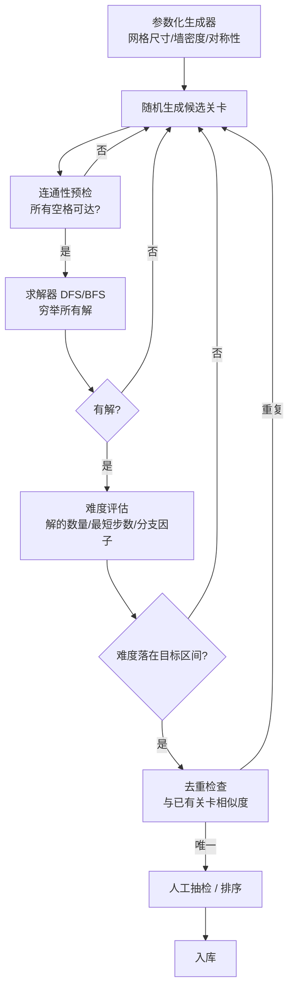

# Longcat · 关卡系统

## 一、核心问题：1900 关从哪来？

Fancade 原版 50 关，商业版 1900+ 关。**手工设计 1900 关不现实**——按每关 30 分钟设计 + 验证算，需要 950 小时。

**结论 `[高置信推断]`**：Longcat 商业版必然采用「**程序生成 + 求解器验证 + 人工筛选**」的流水线。

下面是这条流水线的可复现架构设计，**可直接用于新项目**。

---

## 二、关卡生产流水线（可直接落地）



### 2.1 各模块要点

| 模块 | 作用 | 实现提示 |
|------|------|---------|
| **生成器** | 按参数随机撒墙 | 参数：网格 W×H、墙密度 15–35%、是否对称、是否保证边缘封闭 |
| **连通性预检** | 快速剔除明显废图 | Flood Fill，O(n)，秒杀 80% 废图 |
| **求解器** | 判定有解 + 枚举解 | 见 2.2，这是整条线的性能瓶颈 |
| **难度评估** | 给关卡打分 | 见 2.3 |
| **去重** | 避免生成同构关卡 | 用「最短解序列 + 网格哈希」做指纹 |

### 2.2 求解器设计

状态空间：`(body占据的格子集合, head位置, 上一步方向)`
因为身体只增不减，且路径是分段直线，**状态可压缩为「已填格集合 + head 位置」**。

```
solve(grid, body, head, last_dir):
    if filled == total_empty: return 1 solution
    count = 0
    for dir in [UP,DOWN,LEFT,RIGHT]:
        if dir == opposite(last_dir): continue
        path, new_head = slide(grid, head, dir)
        if path.empty(): continue
        if path 会形成"死腔": continue          # 剪枝，见下
        count += solve(grid, body+path, new_head, dir)
    return count
```

**关键剪枝（决定生成器能不能跑起来）**：

| 剪枝 | 原理 | 收益 |
|------|------|------|
| **死腔剪枝** | 若某次移动后，出现一个"孤立空格群"，其大小 < 当前可达路径能填充的最小段长 → 必死 | 砍掉绝大部分分支 |
| **奇偶性剪枝** | 网格染色（黑白棋盘格），某些布局下黑白格数差决定了哈密顿路径的存在性 | 数学级剪枝，O(1) |
| **记忆化** | `(filled_bitmask, head, dir)` 哈希缓存 | 对小网格（≤ 6×8）极有效 |
| **对称性剪枝** | 第一步去掉旋转对称的等价方向 | 4 倍加速 |

**规模建议**：网格控制在 **5×5 ~ 8×10**。超过这个量级，穷举求解会指数爆炸，需要改用启发式（只找 1 个解 + 估算难度）。

### 2.3 难度量化指标

Longcat 官方 50 关数据反推出的三个可用指标：

```
Difficulty = w1 × (最短解步数 / 总格数)      # 路径复杂度
           + w2 × (1 / 解的数量)             # 稀缺度 ← 权重应最高
           + w3 × (死腔触发率)               # 陷阱密度
```

| 指标 | 计算方式 | 权重建议 |
|------|---------|---------|
| **解的数量** | 求解器穷举出的总解数 | **最高**（1 解 = 硬谜题，100+ 解 = 送分关） |
| **最短解步数** | BFS 最短解 | 中等（线性难度） |
| **首步容错率** | 第一步的 4 个方向中，有多少个仍能通关 | 高（决定"第一印象难度"） |
| **平均存活步数** | 随机走法平均能撑几步 | 高（决定挫败感） |

**「首步容错率」是我认为最被低估的指标**——它直接决定玩家重开几次能过。
- 容错率 75%（4 个方向 3 个能过）→ 送分关
- 容错率 25% → 标准关
- 容错率 0%（只有 1 条路）→ Boss 关

---

## 三、关卡数据结构（建议）

```json
{
  "id": 33,
  "size": [7, 9],
  "grid": "#########....",
  "start": [3, 1],
  "meta": {
    "min_steps": 21,
    "solution_count": 2,
    "first_move_tolerance": 0.25,
    "difficulty_score": 8.7,
    "source": "generated" | "handmade",
    "tags": ["boss", "long_path"]
  }
}
```

**设计要点**：
- `grid` 用字符串存，省空间、易 diff、易在小程序包体里压缩
- `meta` 全部由生成器离线算出，**运行时不计算**
- 关卡数据与代码分离 → 更新关卡不需重新提审小程序（**这对微信小程序至关重要**，见 `notes/对微信小游戏项目的启示.md`）

---

## 四、难度分级与投放

参考官方 50 关的分段，给出可复用的分级模板：

| 档位 | 网格 | 最短解步数 | 解的数量 | 首步容错 | 用途 |
|------|------|-----------|---------|---------|------|
| 教学 | 4×5 | 4–7 | > 50 | > 75% | 前 5 关 |
| 简单 | 5×6 | 7–11 | 20–50 | 50–75% | 建立信心 |
| 普通 | 6×7 | 11–15 | 5–20 | 25–50% | 主体内容 |
| 困难 | 7×8 | 15–19 | 2–5 | 10–25% | 中后期 |
| Boss | 8×10 | 19–22 | 1–2 | 0–10% | 每 10–15 关一个 |
| 调剂 | 5×6 | 6–9 | 10–30 | 40–60% | **插在 Boss 之后** |

**"调剂关"是必须的**——官方第 15 关（8 步）、第 40 关（12 步）、第 47 关（12 步）都是这个角色。没有它，玩家会在高压期集中流失。

---

## 五、内容量的现实估算

| 目标 | 关卡数 | 手工成本 | 生成器成本 | 玩家消耗速度 |
|------|-------|---------|-----------|-------------|
| MVP 验证 | 30–50 | 15–25 小时 | 一次性开发 ~20 小时 | 1–2 天 |
| 上线门槛 | 150–300 | 不现实 | +10 小时调参 | 1–2 周 |
| 有竞争力 | 500–1000 | ❌ | +调参调优 | 1–2 月 |
| Longcat 级别 | 1900+ | ❌ | 成熟的生成器 + 长期迭代 | 数月 |

**关键洞察**：这类游戏的**护城河是生成器，不是关卡数**。
有了生成器，1900 关只是跑一晚上的事；没有生成器，300 关就是人力天花板。

**对新项目的建议**：
- **生成器应该在 MVP 阶段就做，而不是"等手工关卡不够用了再做"**
- 前 20 关手工设计（保证教学质量和第一印象），之后全部交给生成器
- 求解器同时复用为「游戏内提示功能」——一份投入，两处收益
