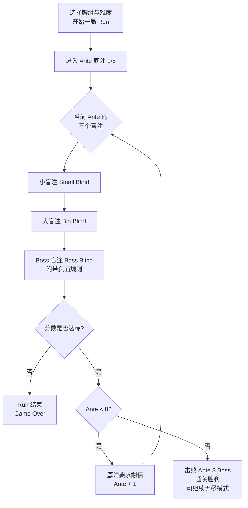
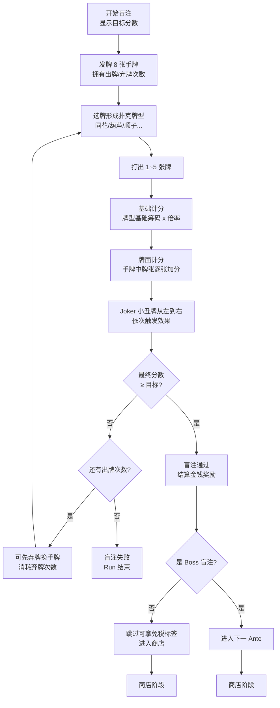
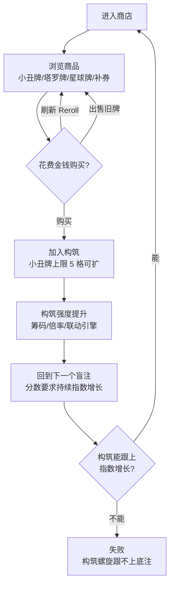

# 小丑牌（Balatro）核心循环流程图

> 用 Mermaid 绘制。可在支持 Mermaid 的编辑器（VS Code 插件、Typora、GitHub）中直接渲染。

## 1. 宏观循环（Run 层）

## 2. 单盲注循环（回合层，核心中的核心）

## 3. 商店 / 构筑循环（经济层）

## 核心张力总结

- **三条循环嵌套**：出牌计分（秒级）→ 盲注/商店（分钟级）→ Ante/整局（30~60 分钟）。
- **指数 vs 线性**：底注要求按指数增长，玩家分数只能靠构筑联动（Joker 之间乘法叠加）指数化提升，这是核心紧张感来源。
- **风险决策点**：弃牌次数分配、金钱 vs 立即战力、跳过盲注换标签、Boss 规则针对性调整构筑。
