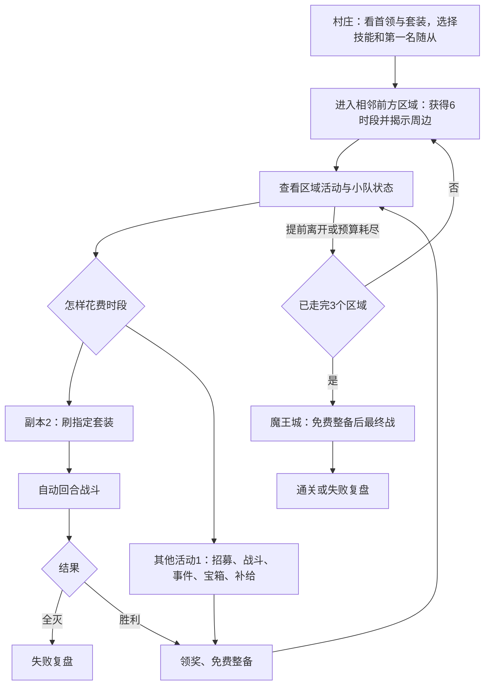

# 总览：把 MMO 的组队刷装压缩为一次远征

版本：v1.0 设计目标；2026-10-05。实现状态见 [GDD 入口](README.md)。

## 1. 产品定位

带着三人小队，在有限远征时段内选路刷装，构筑队伍并攻破魔王城。

面向喜欢规划流派、观察自动战斗、愿意为装备调整路线，但不愿进行高频操作的单人玩家。已确认 Godot 开发、Steam 发布；首发开发目标先收敛为 Windows 键鼠，其他系统和手柄由发布前实测决定。买断制是本版产品建议，价格与市场规模尚无调研结论。

这里的 Idle 指自动执行战斗。无离线挂机收益、现实时间体力恢复和无限副本；暂停思考不消耗资源。MMO 感来自“看首领掉落—组队—应对机制—取得关键装备”，不依赖联网、开放世界或日常任务。

本轮参考依据是本项目 [HTML MVP](../html-mvp/README.md) 和用户的地图草图。旧稿列举的竞品只作为历史灵感；尚未进行新一轮市场对比，不据此承诺销量或内容时长。

## 2. 三个支柱

| 支柱 | 玩家感受 | 落地方式 | 失败信号 |
|---|---|---|---|
| 有目的地冒险 | “我想要这件，所以走这条路” | 首领地标与套装用途先可见，活动局部揭雾 | 玩家从不看掉落，路线只按最短路径选 |
| 有限时间的贪心 | “再刷一次，还是保命和招人？” | 每区独立预算，副本与休整争用时段 | 固定三刷或固定菜单成为唯一正确答案 |
| 看得懂的队伍构筑 | “这次是阵位、技能与装备配合赢了” | 确定性回合、公开意图、可追溯战报 | 胜败只能归因于战力或运气 |

## 3. 三层循环

- **秒级**：查看已配置战术 → 自动行动与意图兑现 → 套装、护盾、标记反馈 → 看懂配合。战中只控制播放，不临场点技能。
- **分钟级**：看地图与掉落 → 进入区域 → 分配时段、招募、刷装、整备 → 消耗生命并形成构筑 → 前往下一地区 → 挑战魔王或失败。
- **跨局**：复盘一次关键取舍 → 在图鉴中理解新组合 → 选择不同队伍与路线再出发 → 解锁挑战与记录。长期收益以知识、选择和收藏为主。

## 4. 一局体验结构

以下为目标，不是当前实测时长。

| 段落 | 体验目标 | 决策重点 |
|---|---|---|
| 村庄，约1分钟 | 看见远处目标，选择初始计划 | 先选打法和同伴，无复杂职业树 |
| 第一区，约3–6分钟 | 学会预算，得到第一次构筑反馈 | 招第二人、争取两件套，还是留时段休整 |
| 第二区，约4–7分钟 | 在确定收益和机会之间权衡 | 凑三件、保留两件＋散件，或转型 |
| 第三区，约3–6分钟 | 为魔王准备，感受放弃的价值 | 按威胁补短板，不为清空地图而清图 |
| 魔王与结算，约2–4分钟 | 配置得到检验，知道下局可改变什么 | 展示胜负原因和路线记录 |

熟悉规则后目标 15–25 分钟；首局阅读允许更长。战斗可快进或跳过，不用强制等待凑时长。若策略密度不足，先增加活动与敌人组合差异，不先拉长路线。

## 5. 核心机制与边界

| 机制 | 目的与规则 | 边界 |
|---|---|---|
| 前进地图 | 9块地图中经过3个探索区，选可通行的相邻前方块 | 不能倒退或横移；揭雾不等于可进入 |
| 远征时段 | 每区6点，副本2点，其他付费行动1点 | 不结转，不随真实时间变化；可提前离开 |
| 区域活动组合 | 固定副本和营地，加3个抽选活动 | 首区必含招募；不让每区都是同一套菜单 |
| 小队 | 主角＋最多两名不同随从；战外调阵位 | 无死亡后永久损失角色、无随从九槽装备 |
| 构筑 | 主角3槽、3套装、2/3件阈值、主动被动各1 | 装备可跨打法使用，无职业穿戴锁 |
| 成长 | 每区首次战斗胜利，全队升一级，最高4级 | 重复刷首领只求装备，不重复刷等级 |
| 失败 | 全队倒下结束；主角倒下但同伴获胜仍能继续 | 不读档重抽结果；可中断并续玩 |
| 局外 | 图鉴、履历、挑战层级 | 无永久战斗数值树来替代学习 |

## 6. 主动收敛的范围

M1 必须做到：一张完整远征地图、三种套装、三种随从、三种副本机制与最终战、六个事件、完整存档。优先让少量规则产生组合，而不是把六职业、九槽、六稀有度、强化石、重铸石、宠物、坐骑一起搬入原型。

M2 通过验证后扩为十二个事件、少量散件特效与首领变体。正式版内容规模须另经重复游玩测试决定，不能把 M1 数量直接视为可售内容量。详细门槛见 [计划](../project-plan/01-原型阶段.md)。

主要代价：固定地图和确定性战斗可能过早被解出；三槽可能过快毕业。先观察重复游玩、路线使用率、两件与三件选择率，再决定增加地图模板或构筑维度。
