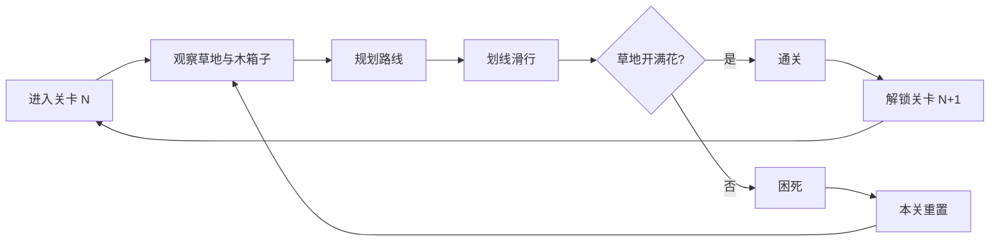
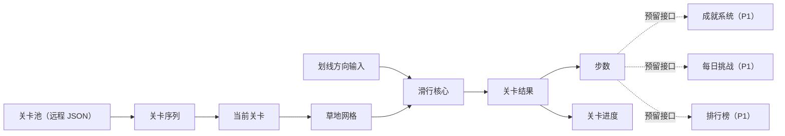

# 顶层设计：longcat

> 状态：本文依据 `01_top_design/analysis.md` 推导，analysis 全部问题块状态为 `user_confirmed`，**本文已定稿**。
> 上游约束：`00_concept/design.md` 概念定稿。本文「当前结论」约束 Architecture。

## 顶层定位

本阶段确定游戏以什么为单位循环、规模多大、哪些系统在范围内，不展开单系统内部规则。

游戏以**单关**为循环单位，关卡线性排列，通关即解锁下一关（类似开心消消乐）。网格尺寸按固定节奏循环变化，提供节奏感与变化感。

玩家的真实心声应该是：

> "就差最后两格了——换个顺序我肯定能填满。下一关是大网格，我要好好想想。"

## 规模锚点表

| 锚点 | 取值 | 依据 |
|---|---|---|
| **循环单位** | 单关 | 独立结算，直线通关 |
| **单关时长** | 20 秒 – 2.5 分钟 | 随网格尺寸变化 |
| **单关步数** | 4 – 22 步 | 硬约束：超过 21–22 步会从解谜退化为试错 |
| **网格尺寸** | 动态循环：小→小→中→中→中→大→大→大→大→大→小…… | 节奏感与变化感 |
| **小网格** | 4×5 ~ 5×6，单关 20–40 秒 | 快速热身 |
| **中网格** | 6×7 ~ 7×8，单关 40–90 秒 | 逐步深入 |
| **大网格** | 7×8 ~ 8×10，单关 90–150 秒 | 深度解谜 |
| **操作复杂度** | 划线选方向，单指滑动 | 概念定稿「输入要少」 |
| **谜题复杂度** | 100% 可解 | 关卡生成器硬约束 |
| **关卡总量** | MVP 手工 20–30 + 生成 100+；长期 500+ | 生成器产能保证 |
| **长期目标** | 成就图鉴 → 关卡推进 → 每日挑战排名 | 三阶段接力 |
| **长期期待** | "我要超过好友" + "明天每日挑战我要拿第一" | — |

> 上表为**量级锚点**，不是最终数值。精确数值归数值表，GDD 不承载。

## 网格循环节奏图

```
关卡序号:  1   2   3   4   5   6   7   8   9  10  11  12 ...
网格尺寸: 小  小  中  中  中  大  大  大  大  大  小  小 ...
```

每 10 关一个完整循环：小(2) → 中(3) → 大(5)。

设计意图：
- 小网格开场：快速热身，建立信心
- 中网格过渡：逐步深入，进入状态
- 大网格为主：深度解谜体验，核心挑战
- 回到小网格：节奏重置，避免疲劳

## 核心循环图



## 资源流图



**MVP 产出 / 消耗：**

| 产出方 | 资源 | 消耗方 |
|---|---|---|
| 关卡系统 | 关卡网格（草地 + 木箱子） | 滑行核心 |
| 滑行核心 | 关卡结果（通关/困死）+ 星级 | 关卡进度 |

**预留接口（P1 迭代）：**

| 接口 | 用途 | 对接系统 |
|---|---|---|
| 关卡成绩记录 | 记录每关星级、步数、用时 | 成就系统 / 排行榜 |
| 分享回调 | 分享成功后的奖励发放 | 分享奖励系统 |
| 每日关卡生成 | 每日挑战关卡的生成与获取 | 每日挑战系统 |

## 单循环流程表

| 阶段 | 玩家行为 | 设计目的 |
|---|---|---|
| 进入关卡 | 看到一片草地、起点银渐层猫、木箱子分布 | 建立"这是一道题"的认知 |
| 观察地形 | 扫描木箱子的分布，找死角与必经点 | 空间推理的起点，全图可读是前提 |
| 规划路线 | 在脑中推演猫咪滑行路径 | 核心思考过程，无时间压力 |
| 划线滑行 | 划线选方向，看着猫走过长出蒲公英 | 即时反馈；轨迹不可逆制造决策重量 |
| 结果判定 | 开满花通关 / 被困住 | 成败完全归因于决策 |
| 通关结算 | 看到蒲公英覆盖的草地、步数 | 奇观奖励 + 解锁下一关 |
| 困死回收 | 本关重置，立即重试 | 零惩罚，换个顺序再来 |
| 撤销操作 | 点击撤销按钮，回退上一步 | 给误操作容错空间，每关限 3 次 |

## 各段设计

### 1. 单关

顶层规则：

- 只存在一个胜利条件：填满全部非障碍格（让草地开满蒲公英）。不做覆盖率分级。
- 输入只有划线选方向；不增加任何操作维度。
- 无时间限制、无步数限制。
- 单关步数上限 22 步；超过则判定为关卡设计失败，不是玩家失败。
- 困死立即可重开，无动画惩罚、无强制广告。
- 通关即解锁下一关，线性推进。
- 通关后记录步数，用于社交比较（排行榜）。
- **每关提供 3 次撤销机会**：点击撤销按钮，回退上一步（蒲公英消失，猫回到上一步位置）。给触屏误操作容错空间。

### 2. 网格尺寸循环

顶层规则：

- 网格尺寸按固定节奏循环：小→小→中→中→中→大→大→大→大→大→小……
- 每 10 关一个完整循环。
- 小网格（4×5 ~ 5×6）：快速热身，20–40 秒。
- 中网格（6×7 ~ 7×8）：逐步深入，40–90 秒。
- 大网格（7×8 ~ 8×10）：深度解谜，90–150 秒。
- 难度靠木箱子的分布（分支稀缺度）调节，不靠放大网格。

## 失败与回收

| 情况 | 结果 |
|---|---|
| 单关困死 | 本关重置，立即重试，零惩罚 |
| 中途退出 | 关卡进度不保存（单关独立） |
| 已通关关卡 | 星级永久保留 |

**核心原则：零惩罚重试，换个顺序再来。** 没有命数、没有 run 结束、没有"白玩了"。失败的唯一代价是"这次没拿到三星"。

## 长期结构（P1 迭代）

1. **成就图鉴**（主轴）：关卡星级、累计通关 → 解锁外观。提供"我在慢慢积累"的情绪价值。
2. **关卡进度**：线性推进；提供"我到哪了"的可见刻度。
3. **每日挑战 + 排行榜**（P1）：每日回访 + 社交对比；提供"明天还来"的理由。
4. **分享奖励**（P1）：裂变拉新；提供"叫朋友来"的动力。

## 系统范围表

### MVP 范围

| 系统 | 顶层目的 | Top Design 边界 |
|---|---|---|
| 滑行核心 | 承载空间解谜本身 | 只管单关内的滑行与胜负；不管关卡从哪来、不管社交 |
| 关卡 | 提供内容与难度曲线 | 只管关卡数据、加载、网格循环、难度分级；不管社交、不管成就 |

### P1 迭代（预留接口）

| 接口 | 对接系统 | 说明 |
|---|---|---|
| 关卡成绩记录 | 成就系统 / 排行榜 | 记录每关星级、步数、用时 |
| 分享回调 | 分享奖励系统 | 分享成功后的奖励发放 |
| 每日关卡生成 | 每日挑战系统 | 每日挑战关卡的生成与获取 |

## 不做清单

1. **不做实时操作 / 手速 / 反应力挑战**——输入永远是划线选方向。
2. **不做数值系统**——无伤害、无血量、无攻击力；外观纯装饰。
3. **不做 Roguelike 元层**——无 run、无命数、无能力三选一。
4. **不做覆盖率分级**——填满即通关，没有"85% 也算过"。
5. **不做无尽模式**——关卡必须预生成并验证可解。
6. **不做剧情 / 角色养成 / 世界观叙事**。
7. **不做多人实时对战 / 异步 PVP**。
8. **不做内购数值售卖**——无版号约束，且设计上不需要。IAA（广告变现）为变现方式。
9. **不把关卡数据打进包体**——4MB 限制与提审周期的硬约束。
10. **MVP 不做社交系统**——预留接口，后续迭代。

## 验证标准表

| 验证点 | 成功标准 |
|---|---|
| 规则是否自明 | 玩家在无任何教程文字的情况下通过前 3 关 |
| 单关节奏是否合意 | 小网格 20–40 秒，中网格 40–90 秒，大网格 90–150 秒 |
| 失败是否归因于决策 | 玩家困死后的主观归因是"我顺序错了"，不是"我手滑了" |
| 失败是否被接住 | 困死后立即重试的比例达到可接受水平 |
| 网格循环是否合理 | 玩家反馈"大小交替"的节奏感舒适，无疲劳感 |
| 关卡是否可批量生产 | 生成器产出的关卡 100% 有解，且难度评分落在目标区间 |
| 预留接口是否可用 | P1 迭代时可直接对接社交系统，无需重构核心 |

## 当前结论

《longcat》的顶层结构是**单关解谜 + 直线通关 + 网格循环**：

> 单关是 20 秒到 2.5 分钟的纯空间解谜（让草地开满蒲公英），网格尺寸按"小→小→中→中→中→大→大→大→大→大"的节奏循环，通关即解锁下一关。MVP 只做滑行核心 + 关卡，预留社交接口，后续迭代加入每日挑战、排行榜、分享奖励。

后续 Architecture 必须围绕这个结论展开：

1. **滑行核心只产出"通关/困死 + 星级"**，不感知社交、成就。
2. **关卡系统负责网格循环与难度调节**，支持动态网格尺寸。
3. **预留接口在架构阶段设计**：关卡成绩记录、分享回调、每日关卡生成。
4. **生成器与求解器在 MVP 内完成**，不等关卡不够用再做。
5. **广告位预留在架构阶段设计**，IAA 变现是项目定位。
