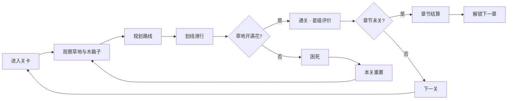
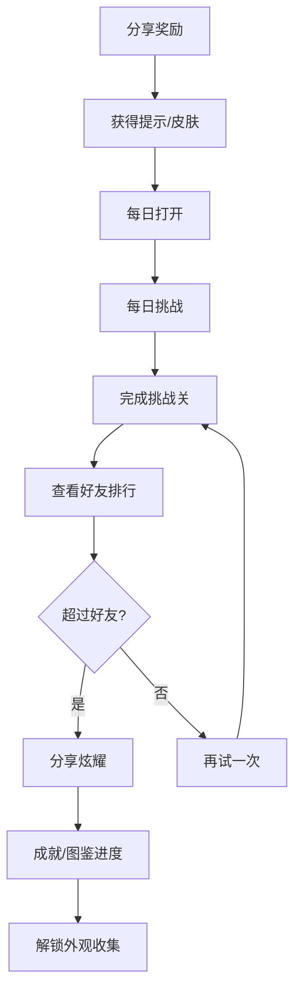
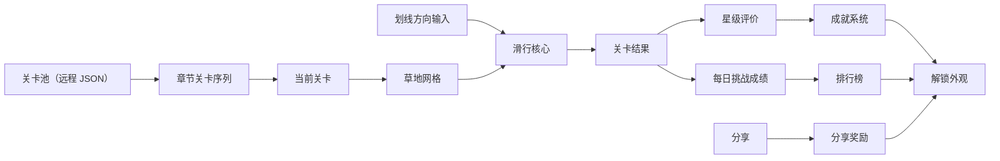

# 顶层设计：longcat

> 状态：本文依据 `01_top_design/analysis.md` 推导，analysis 全部问题块状态为 `agent_proposal`，**本文为草案**。
> 上游约束：`00_concept/design.md` 概念定稿。本文「当前结论」约束 Architecture。

## 顶层定位

本阶段确定游戏以什么为单位循环、规模多大、哪些系统在范围内，不展开单系统内部规则。

游戏由两层循环构成：内层是**单关解谜循环**（30 秒–2 分钟，提供即时反馈），外层是**章节推进循环**（每章 8–10 关，提供中期目标）。单关是社交比拼的基本单位。

玩家的真实心声应该是：

> "就差最后两格了——换个顺序我肯定能填满。明天每日挑战那关，我要拿最少步数。"

## 规模锚点表

| 锚点 | 取值 | 依据 |
|---|---|---|
| **循环单位** | 单关（内层） / 章节（外层） | 双循环结构 |
| **单关时长** | 30 秒 – 2 分钟 | 观察 2–10 秒 + 规划 5–30 秒 + 执行 5–20 秒 |
| **单关步数** | 4 – 22 步 | 硬约束：超过 21–22 步会从解谜退化为试错 |
| **网格尺寸** | 5×6 ~ 8×10，**不随难度递增** | 难度靠木箱子的分布，不靠放大网格 |
| **操作复杂度** | 划线选方向，单指滑动 | 概念定稿「输入要少」 |
| **谜题复杂度** | 100% 可解 | 关卡与能力解耦的硬约束 |
| **章节规模** | 每章 8–10 关 | 提供中期进度感 |
| **关卡总量** | MVP 手工 20–30 + 生成 100+；长期 500+ | 生成器产能保证 |
| **长期目标** | 成就图鉴 → 章节推进 → 每日挑战排名 | 三阶段接力 |
| **长期期待** | "我要超过好友" + "明天每日挑战我要拿第一" | — |

> 上表为**量级锚点**，不是最终数值。精确数值归数值表，GDD 不承载。

## 核心循环图

## 社交循环图

## 资源流图

**谁产出什么 / 谁消耗什么：**

| 产出方 | 资源 | 消耗方 |
|---|---|---|
| 关卡系统 | 关卡网格（草地 + 木箱子） | 滑行核心 |
| 滑行核心 | 关卡结果（通关/困死）+ 星级 | 成就系统 / 每日挑战 |
| 每日挑战 | 每日关卡 + 排行数据 | 排行榜 |
| 成就系统 | 成就进度 + 外观解锁 | 收集系统 |
| 分享系统 | 分享奖励 | 收集系统 |

## 单循环流程表

| 阶段 | 玩家行为 | 设计目的 |
|---|---|---|
| 进入关卡 | 看到一片草地、起点银渐层猫、木箱子分布 | 建立"这是一道题"的认知 |
| 观察地形 | 扫描木箱子的分布，找死角与必经点 | 空间推理的起点，全图可读是前提 |
| 规划路线 | 在脑中推演猫咪滑行路径 | 核心思考过程，无时间压力 |
| 划线滑行 | 划线选方向，看着猫走过长出蒲公英 | 即时反馈；轨迹不可逆制造决策重量 |
| 结果判定 | 开满花通关 / 被困住 | 成败完全归因于决策 |
| 通关结算 | 看到星级评价、蒲公英覆盖的草地 | 奇观奖励 + 成就进度推进 |
| 困死回收 | 本关重置，立即重试 | 零惩罚，换个顺序再来 |
| 章节结算 | 看到章节完成度 | 中期进度感 |

## 各段设计

### 1. 单关（内层循环）

顶层规则：

- 只存在一个胜利条件：填满全部非障碍格（让草地开满蒲公英）。不做覆盖率分级。
- 输入只有划线选方向；不增加任何操作维度。
- 无时间限制、无步数限制。
- 单关步数上限 22 步；超过则判定为关卡设计失败，不是玩家失败。
- 困死立即可重开，无动画惩罚、无强制广告。
- 通关后给予星级评价（1–3 星），星级依据步数。

### 2. 章节（外层循环）

顶层规则：

- 每章 8–10 关，线性推进。
- 章节提供"我到哪了"的进度感。
- 通关章节末关 → 章节结算 → 解锁下一章。
- 章节内每关独立，无跨关累积。
- 章节难度递增，但网格尺寸不变，靠木箱子分布调节。

### 3. 社交系统

顶层规则：

- **每日挑战**：每天一关，全服同一关，比步数/星级。提供每日回访理由。
- **好友排行榜**：展示好友的关卡进度/每日挑战成绩。提供社交对比动力。
- **分享奖励**：分享关卡成绩/每日挑战结果，获得提示道具或外观。提供裂变拉新。

### 4. 收集系统

顶层规则：

- 收集的主体是**外观**——猫咪皮肤、草地主题、蒲公英样式。
- 外观通过**成就达成**解锁，不提供任何数值优势。
- 成就类型：关卡三星、章节全通、最少步数、累计通关数等。
- 图鉴页面展示已解锁/未解锁内容，提供"全收集"的长期目标。

## 失败与回收

| 情况 | 结果 |
|---|---|
| 单关困死 | 本关重置，立即重试，零惩罚 |
| 中途退出 | 关卡进度不保存（单关独立，无 run 结构） |
| 章节内部分通关 | 已通关关卡的星级永久保留 |
| 每日挑战未完成 | 当天不结算，明天刷新新关卡 |

**核心原则：零惩罚重试，换个顺序再来。** 没有命数、没有 run 结束、没有"白玩了"。失败的唯一代价是"这次没拿到三星"。

## 长期结构

1. **成就图鉴**（主轴）：关卡星级、章节全通、累计数据 → 解锁外观。提供"我在慢慢积累"的情绪价值。
2. **章节进度**：关卡按章节组织，通关推进；提供"我到哪了"的可见刻度。
3. **每日挑战 + 排行榜**：每日回访 + 社交对比；提供"明天还来"的理由。
4. **分享奖励**：裂变拉新；提供"叫朋友来"的动力。

三者的时间接力关系：前 3 天靠成就解锁建立"我在变多"；第 1–4 周靠章节进度提供探索内容；长期靠每日挑战与排行榜形成习惯。

## 系统范围表

| 系统 | 顶层目的 | Top Design 边界 |
|---|---|---|
| 滑行核心 | 承载空间解谜本身 | 只管单关内的滑行与胜负；不管关卡从哪来、不管章节、不管社交 |
| 关卡 | 提供内容与难度曲线 | 只管关卡数据、加载、难度分级、章节组织；不管社交、不管成就 |
| 每日挑战 | 提供每日回访理由 | 只管每日关卡生成与成绩记录；不管排行展示（归社交） |
| 社交 | 提供对比与裂变 | 只管排行榜与分享奖励；不管关卡、不管成就 |
| 成就/收集 | 提供长期目标与情绪价值 | 只管成就判定与外观解锁；不管关卡、不管社交 |

## 不做清单

1. **不做实时操作 / 手速 / 反应力挑战**——输入永远是划线选方向。
2. **不做数值系统**——无伤害、无血量、无攻击力；外观纯装饰。
3. **不做 Roguelike 元层**——无 run、无命数、无能力三选一。
4. **不做覆盖率分级**——填满即通关，没有"85% 也算过"。
5. **不做动态难度递增**——网格不随进度变大，难度靠木箱子分布调节。
6. **不做无尽模式**——关卡必须预生成并验证可解。
7. **不做剧情 / 角色养成 / 世界观叙事**。
8. **不做多人实时对战 / 异步 PVP**。
9. **不做内购数值售卖**——无版号约束，且设计上不需要。IAA（广告变现）为变现方式。
10. **不把关卡数据打进包体**——4MB 限制与提审周期的硬约束。

## 验证标准表

| 验证点 | 成功标准 |
|---|---|
| 规则是否自明 | 玩家在无任何教程文字的情况下通过前 3 关 |
| 单关节奏是否合意 | 单关时长中位数落在 45–90 秒 |
| 失败是否归因于决策 | 玩家困死后的主观归因是"我顺序错了"，不是"我手滑了" |
| 失败是否被接住 | 困死后立即重试的比例达到可接受水平 |
| 每日挑战是否驱动回访 | 次日回访率相比无每日挑战有显著提升 |
| 分享是否驱动裂变 | 分享转化率（分享→新增）达到可接受水平 |
| 成就是否驱动收集 | 玩家主动查看图鉴/成就页面的频率 |
| 关卡是否可批量生产 | 生成器产出的关卡 100% 有解，且难度评分落在目标区间 |

## 当前结论

《longcat》的顶层结构是**单关解谜 + 章节推进 + 社交比拼**：

> 单关是 30 秒到 2 分钟的纯空间解谜（让草地开满蒲公英），章节提供中期进度，每日挑战与好友排行榜提供社交比拼，成就图鉴提供收集情绪价值。核心谜题规则保持纯粹，差异化全部压在社交层。

后续 Architecture 必须围绕这个结论展开：

1. **滑行核心只产出"通关/困死 + 星级"**，不感知社交、成就、章节。
2. **关卡与章节解耦**——关卡系统只管单关数据与难度，章节是关卡的组织层。
3. **每日挑战与排行榜需要后端/云开发支持**，架构阶段必须解决。
4. **生成器与求解器在 MVP 内完成**，不等关卡不够用再做。
5. **广告位预留在架构阶段设计**，IAA 变现是项目定位。
