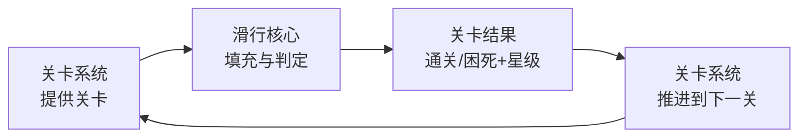
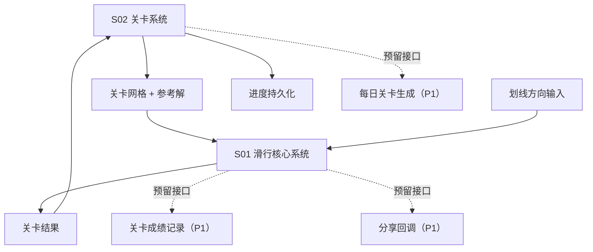
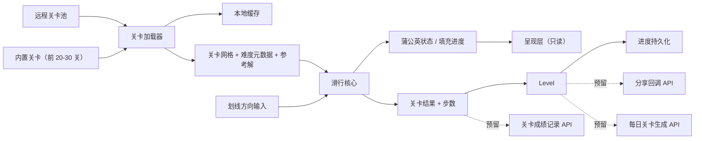

# 系统架构：longcat

> 状态：本文依据 `02_architecture/analysis.md` 推导，analysis 全部问题块状态为 `user_confirmed`，**本文已定稿**。
> 本文「目录映射」决定 `03_systems/` 的拆分，不得自行增删。

## 架构定位

本阶段确定「哪些系统支撑一轮玩法」，不展开单系统内部规则。

架构的第一性问题是如何让「单关解谜 + 直线通关 + 网格循环」这个顶层结论**在工程上真正守住**。三条铁律由此推出：

1. **关卡数据所有权归关卡系统独占**——配合远程化与生成器校验。
2. **离线验证与运行时共用同一份规则代码**——保证内容护城河不因实现分叉而失效。
3. **网格尺寸由关卡序号动态计算**——保证节奏一致性与生成器自动化。

## 一句话架构

玩家从关卡系统取得当前关卡，用划线选方向驱动滑行核心填满草地；滑行核心只产出「通关 / 困死 + 星级」结果，由关卡系统消耗并推进到下一关；网格尺寸按关卡序号动态循环（小→小→中→中→中→大→大→大→大→大→小……）。

## 总体闭环

## P0 系统清单

| 系统 | 目的 | 输入 | 输出 | P0 原因 |
|---|---|---|---|---|
| **S01 滑行核心系统** | 承载空间解谜本身：网格、滑行结算、蒲公英固化、通关与困死判定、撤销功能（每关 3 次） | 网格数据、划线方向输入 | 蒲公英状态、填充进度、关卡结果（通关/困死）、步数 | 没有它就没有游戏本身 |
| **S02 关卡系统** | 提供内容与难度曲线：关卡数据、远程加载、缓存、网格循环、难度分级、生成验证工具链、进度持久化 | 关卡序号、网络 | 关卡网格、难度元数据、预存参考解、当前进度、通关记录 | 没有它只有一关，且内容无法远程更新与批量生产 |

### 存档层（非 GDD 系统，架构组件）

| 组件 | 目的 | 说明 |
|---|---|---|
| 存档层 | 统一收集各系统状态快照，原子写入，版本迁移 | **只有存储权，没有修改权**；不做任何业务判断。归属执行文档，不占 `03_systems/` 目录 |

## P1 / P2 边界

### P1：MVP 成立后优先扩展

| 能力 | 说明 |
|---|---|
| 每日挑战 | 全服同题比步数；微信生态最强留存钩子 |
| 好友排行榜 | 微信社交红利；依赖用户基数，故排在 P1 |
| 分享奖励 | 分享得提示/皮肤；裂变拉新 |
| 成就图鉴 | 关卡星级、累计通关 → 解锁外观；提供"我在慢慢积累"的情绪价值 |
| 提示 / 复活广告实际接入 | MVP 只预留位置 |

### P2：后期实验或内容扩展

| 能力 | 说明 |
|---|---|
| 群排行榜 | 依赖每日挑战与排行榜稳定 |
| 赛季 / 赛季奖励 | 依赖每日挑战与排行榜稳定 |
| 关卡编辑器 + UGC 分享 | 重功能，依赖用户基数 |
| 皮肤收集 | 外观向，不承担成长职责 |
| App 端与海外 H5 分发 | 依赖 MVP 数据验证 |
| 无尽模式 | 与「关卡必须预验证可解」冲突，需重新论证 |

## 系统依赖

依赖关系的硬约束：

1. **因果单向**：S01 只输出「通关 / 困死 + 步数」这一结果，**不发放任何长期成长**。
2. **S01 不感知关卡序号与网格循环**：它只接收当前关卡的网格数据，不知道这关是小/中/大。

## 数据流

## 系统职责说明

### 1. S01 滑行核心系统

负责网格结构、一次滑行的结算、路径固化（蒲公英生长）、通关与困死判定、撤销功能（每关 3 次）。

它不负责关卡从哪来、不负责关卡序号与网格循环、不负责任何持久化、不负责渲染。

**它只回答一个问题：给定网格、当前蒲公英状态和一次划线输入，接下来发生什么。**

### 2. S02 关卡系统

负责关卡数据的完整生命周期：内置关卡与远程关卡的加载、本地缓存、网格循环（按序号动态计算尺寸）、难度分级、进度持久化，以及离线侧的生成器与求解器工具链。

它不负责关卡内的滑行规则、不负责关卡内容的美术表现。

**它独占关卡数据的读写权。** 其他系统只能通过关卡 ID 请求，不得持有或缓存网格内容。

### 3. 呈现层（非 GDD 系统，见「呈现契约」）

不单列 GDD 系统。本游戏信息量极小（一屏草地 + 猫咪 + 木箱子 + 星级），无需要决策的呈现逻辑。

## 呈现契约

架构层集中声明一次，各系统的「不负责」清单负责落实：

| # | 契约 | 理由 |
|---|---|---|
| 1 | 呈现层**只读取状态**，不做任何规则判断 | 若渲染层判断"哪些格子可走"，离线求解器的验证结论就与运行时不一致，内容护城河崩塌 |
| 2 | 呈现层**不替玩家解题**——不自动高亮可行路径、不预测滑行结果 | 本游戏的核心乐趣就是自己推演路径 |
| 3 | **禁止"自动排除无效方向"类辅助** | 不允许把推不动的方向置灰，不允许阻止无效输入。玩家必须能自己撞墙、自己发现走不通——这是学习过程的一部分 |
| 4 | UI 布局、美术规格、动效归执行文档与美术文档 | GDD 不承载 UI 与美术 |

## 目录映射

| 目录 | 本阶段定位 |
|---|---|
| `03_systems/S01_slide_core/` | 网格结构、滑行结算、蒲公英固化、通关与困死判定、撤销功能 |
| `03_systems/S02_level/` | 关卡数据结构、内置与远程加载、本地缓存、网格循环、难度分级、进度持久化、离线生成器与求解器工具链 |

## MVP 最小闭环

MVP 只验证「滑行填充 + 网格循环」这个核心玩法是否成立：

1. 玩家打开游戏，进入第一关（小网格），看到一片草地、起点的银渐层猫、木箱子分布。
2. 玩家划线选方向，猫一路滑到撞墙停下，走过的地方长出蒲公英。
3. 玩家划错了一步，点击撤销按钮，蒲公英消失，猫回到上一步位置（每关 3 次撤销机会）。
4. 玩家连续划线填满全部草地，通关，看到步数。
5. 通关后解锁下一关（第二关，小网格）。
6. 玩家困死，本关重置，立即重试，零惩罚。
7. 玩家退出游戏，次日回来，从上次通关的关卡继续。
8. 随着关卡推进，网格尺寸按节奏循环（小→小→中→中→中→大→大→大→大→大→小……）。

如果这条闭环不成立，**不应继续增加**：每日挑战、排行榜、分享奖励、成就图鉴、皮肤收集、关卡编辑器、剧情、无尽模式。

## 预留接口

MVP 虽不实现社交与成就系统，但必须预留以下接口，保证 P1 迭代时可直接对接：

| 接口 | 触发时机 | 数据 | 用途 |
|---|---|---|---|
| `onLevelComplete(levelId, stars, steps, time)` | 通关时 | 关卡 ID、星级、步数、用时 | 排行榜、成就、每日挑战 |
| `onShareComplete(shareType, reward)` | 分享成功回调 | 分享类型、奖励内容 | 分享奖励 |
| `getDailyLevel(date)` | 每日挑战入口 | 日期 | 返回每日关卡 ID |

## 风险与校验

| 风险 | 校验方式 |
|---|---|
| 滑行核心被关卡逻辑污染 | S01 代码中是否出现任何关卡序号或网格尺寸判断（代码审查硬指标） |
| 离线验证与运行时行为分叉 | 离线工具与运行时是否 import 同一份 `core/` 规则代码（架构检查项） |
| 关卡数据所有权泄漏 | 除 S02 外是否有系统持有网格内容（代码审查项） |
| 网格循环节奏不合理 | 玩家反馈"大小交替"的节奏感舒适，无疲劳感 |
| 呈现层替玩家解题，削掉核心玩法 | UI 上是否出现可行路径高亮、无效方向置灰、滑行结果预测 |
| 求解器性能爆炸导致内容产能不足 | 8×10 网格 + 强剪枝下单关求解耗时是否可接受（阈值归数值表） |
| 关卡难度曲线失控 | 生成器产出的关卡难度评分是否落在目标区间，且存在刻意的回落调剂关 |
| 预留接口未定义或定义不清 | P1 迭代时能否直接对接，无需重构核心 |
