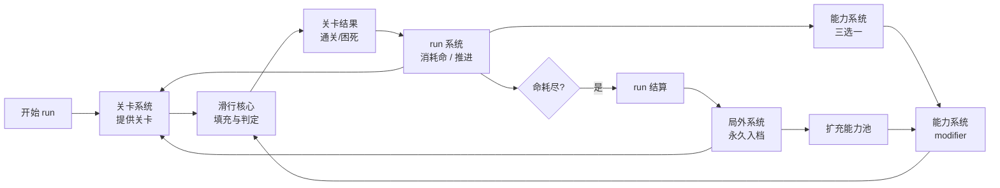
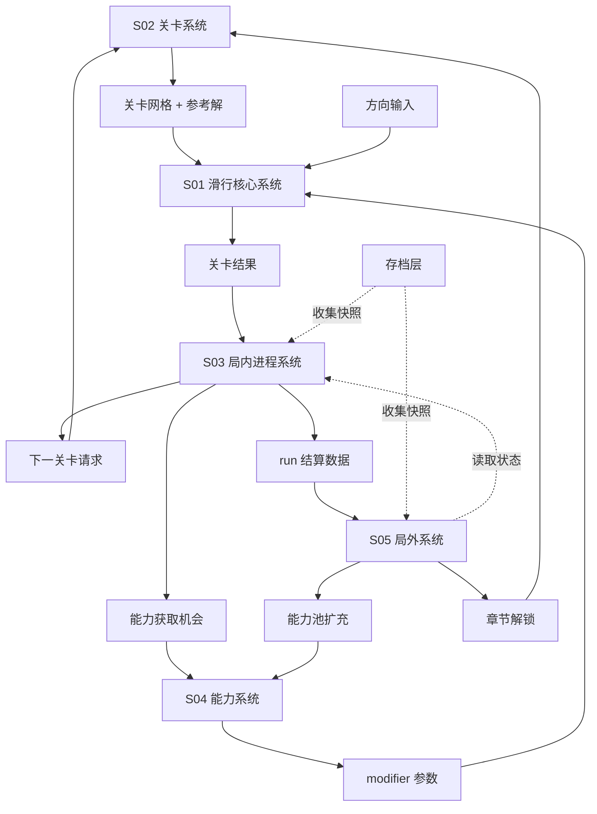
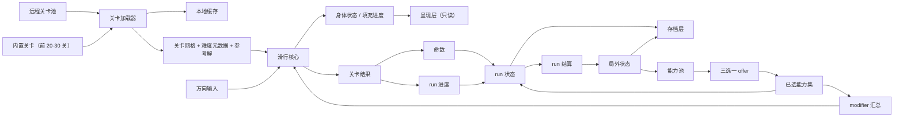

# 系统架构：longcat

> 状态：本文依据 `02_architecture/analysis.md` 推导，analysis 全部问题块状态为 `agent_proposal`，**本文为草案**。
> 本文「目录映射」决定 `03_systems/` 的拆分，不得自行增删。

## 架构定位

本阶段确定「哪些系统支撑一轮玩法」，不展开单系统内部规则。

架构的第一性问题是如何让「差异化全部压在元层」这个顶层结论**在工程上真正守住**。四条铁律由此推出：

1. **能力以参数单向注入，核心零能力分支**——防止规则层被回收层污染。
2. **所有 modifier 必须是放宽约束型**——保证「无能力可解 ⇒ 任意能力组合下可解」。
3. **关卡数据所有权归关卡系统独占**——配合远程化与生成器校验。
4. **离线验证与运行时共用同一份规则代码**——保证内容护城河不因实现分叉而失效。

## 一句话架构

玩家在一次 run 中从关卡系统连续取得关卡，用四个方向驱动滑行核心填满网格；滑行核心只产出「通关 / 困死」结果，由 run 系统消耗命并发放能力机会，能力系统把选中的能力折算成放宽型 modifier 注入下一关的滑行核心；run 结束后局外系统把进展永久入档并扩充能力池。

## 总体闭环

## P0 系统清单

| 系统 | 目的 | 输入 | 输出 | P0 原因 |
|---|---|---|---|---|
| **S01 滑行核心系统** | 承载空间解谜本身：网格、滑行结算、身体固化、胜负判定 | 网格数据、方向输入、modifier 参数 | 身体状态、填充进度、关卡结果（通关/困死） | 没有它就没有游戏本身 |
| **S02 关卡系统** | 提供内容与难度曲线：关卡数据、远程加载、缓存、难度分级、生成验证工具链 | 关卡 ID、章节进度、网络 | 关卡网格、难度元数据、预存参考解 | 没有它只有一关，且内容无法远程更新与批量生产 |
| **S03 局内进程系统（run）** | 提供张力与推进结构：run 结构、命、失败回收、关卡序列、run 结算 | 关卡结果、主动放弃事件 | run 状态（命数、进度）、能力获取机会、结算数据 | 没有它，困死即结束，与「失败要接住」直接冲突 |
| **S04 能力系统** | 提供每局不同的规则修正：能力池、三选一、modifier 汇总 | 能力获取机会、玩家选择、已解锁能力池 | 生效能力集、modifier 参数 | 差异化核心；没有它本项目等同 Longcat 换皮 |
| **S05 局外系统** | 提供长期成长与留存：进度持久化、能力池解锁、广告位预留 | run 结算数据、日期 | 解锁状态、持久化存档、广告触发点 | 没有它 run 结束什么都不留下，测不出留存 |

### 存档层（非 GDD 系统，架构组件）

| 组件 | 目的 | 说明 |
|---|---|---|
| 存档层 | 统一收集各系统状态快照，原子写入，版本迁移 | **只有存储权，没有修改权**；不做任何业务判断。归属执行文档，不占 `03_systems/` 目录 |

## P1 / P2 边界

### P1：MVP 成立后优先扩展

| 能力 | 说明 |
|---|---|
| 每日挑战 | 全服同题比步数；微信生态最强留存钩子 |
| 群排行榜 / 分享 | 微信社交红利；依赖用户基数，故排在 P1 |
| 分享求提示 | 提示功能 + 社交裂变的结合点 |
| 机制变体方块（冰块 / 传送门） | 谜题维度扩展；需重做求解器剪枝，故后置 |
| 目标变体模式（收集 + 终点） | 作为独立模式，不替换核心胜利条件 |
| 皮肤收集 | 外观向，不承担成长职责 |
| 提示 / 复活广告实际接入 | MVP 只预留位置 |

### P2：后期实验或内容扩展

| 能力 | 说明 |
|---|---|
| 关卡编辑器 + UGC 分享 | 重功能，依赖用户基数 |
| 赛季 / 赛季奖励 | 依赖每日挑战与排行榜稳定 |
| 多结局 / 章节 Boss 变体 | 依赖足够内容量 |
| App 端与海外 H5 分发 | 依赖 MVP 数据验证 |
| 无尽模式 | 与「关卡必须预验证可解」冲突，需重新论证 |

## 系统依赖

依赖关系的两条硬约束：

1. **因果单向**：S01 只输出「通关 / 困死」这一结果，**不发放任何长期成长**。命的消耗与能力的发放全在 S03/S04。
2. **S01 不感知能力概念**：它只接收一个 modifier 参数对象，不知道这些参数从哪来。

## 数据流

## 系统职责说明

### 1. S01 滑行核心系统

负责网格结构、一次滑行的结算、路径固化、通关与困死判定，以及接收并应用 modifier 参数。

它不负责关卡从哪来、不负责 run 如何组织关卡、不负责能力如何定义与选择、不负责任何持久化、不负责渲染。

**它只回答一个问题：给定网格、当前身体和一次方向输入，接下来发生什么。**

### 2. S02 关卡系统

负责关卡数据的完整生命周期：内置关卡与远程关卡的加载、本地缓存、章节组织、难度分级，以及离线侧的生成器与求解器工具链。

它不负责关卡内的滑行规则、不负责 run 如何排列关卡、不负责章节进度的解锁判定（归 S05）、不负责关卡内容的美术表现。

**它独占关卡数据的读写权。** 其他系统只能通过关卡 ID 请求，不得持有或缓存网格内容。

### 3. S03 局内进程系统（run）

负责一次 run 的完整结构：初始化命数与空能力集、维护关卡序列、接收关卡结果并消耗命或推进、响应主动放弃、判定 run 结束、产出结算数据。

它不负责滑行规则、不负责能力内部效果、不负责局外解锁的判定、不负责能力池内容。

**它独占 run 内状态（命数、当前进度）的修改权**，且这些状态必须可跨会话持久化。

### 4. S04 能力系统

负责能力池管理、三选一的 offer 生成、已选能力集的维护，以及把能力集折算成 modifier 参数。

它不负责滑行规则如何执行 modifier（归 S01）、不负责何时给能力机会（归 S03）、不负责哪些能力已解锁（归 S05）、不负责 UI 呈现。

**它独占能力集与 modifier 的计算权。** 硬约束：产出的 modifier 必须是放宽约束型。

### 5. S05 局外系统

负责长期成长与留存：把 run 结算转化为能力池解锁与章节进度、持久化局外状态、预留广告触发点。

它不负责 run 内状态、不负责单次 run 的推进规则、不负责关卡内容、不负责能力的具体效果。

**它独占局外状态的修改权**，且局外进度一经获得立即入档、不可被任何失败剥夺。

### 6. 呈现层（非 GDD 系统，见「呈现契约」）

不单列 GDD 系统。本游戏信息量极小（一屏网格 + 命数 + 能力图标），无需要决策的呈现逻辑。

## 呈现契约

架构层集中声明一次，各系统的「不负责」清单负责落实：

| # | 契约 | 理由 |
|---|---|---|
| 1 | 呈现层**只读取状态**，不做任何规则判断 | 若渲染层判断"哪些格子可走"，离线求解器的验证结论就与运行时不一致，内容护城河崩塌 |
| 2 | 呈现层**不替玩家解题**——不自动高亮可行路径、不预测滑行结果 | 本游戏的核心乐趣就是自己推演路径 |
| 3 | **禁止"自动排除无效方向"类辅助** | 不允许把推不动的方向置灰，不允许阻止无效输入。玩家必须能自己撞墙、自己发现走不通——这是学习过程的一部分 |
| 4 | UI 布局、美术规格、动效归执行文档与美术文档 | GDD 不承载 UI 与美术 |

## 目录映射

| 目录 | 本阶段定位 |
|---|---|
| `03_systems/S01_slide_core/` | 网格结构、滑行结算、身体固化、通关与困死判定、modifier 参数定义与应用 |
| `03_systems/S02_level/` | 关卡数据结构、内置与远程加载、本地缓存、章节组织、难度分级、离线生成器与求解器工具链 |
| `03_systems/S03_run/` | run 结构、命、关卡序列、困死与放弃的回收、run 结束判定与结算 |
| `03_systems/S04_ability/` | 能力池、三选一 offer、能力集维护、modifier 汇总与放宽约束校验 |
| `03_systems/S05_meta/` | 局外解锁（能力池扩充、章节进度）、持久化、广告位预留、每日挑战与排行榜（P1） |

## MVP 最小闭环

MVP 不追求社交、编辑器与内容规模，只验证「能力系统能否带来重玩价值」这一核心假设：

1. 玩家打开游戏，进入第一关，看到一张空白网格和起点的猫。
2. 玩家滑动一个方向，猫一路滑到撞墙停下，走过的格子变成身体。
3. 玩家连续输入填满全部格子，通关，看到猫的长度。
4. 通关后从三个能力中选择一个，能力进入本次 run 的能力集。
5. 进入下一关，该能力以 modifier 形式生效（例如允许撤销一次、允许回头一次）。
6. 玩家困死，消耗一条命，本关重置，**已获得的能力全部保留**。
7. 玩家退出游戏，次日回来，run 从第 6 关继续，命数与能力集完全恢复。
8. 命耗尽，run 结束，展示结算（到达第几关、最长的猫、能力组合），一个新能力进入能力池。

如果这条闭环不成立，**不应继续增加**：机制变体方块、目标变体模式、每日挑战、排行榜、皮肤、关卡编辑器、剧情、无尽模式。

## 风险与校验

| 风险 | 校验方式 |
|---|---|
| 能力退化成数值加成，破坏谜题纯粹性 | 每个能力能否用一句话说清"它改变了哪条规则"，而不需要引用任何数字 |
| modifier 出现收紧约束型，导致关卡在某个能力组合下无解 | 离线校验：任意关卡在**无能力**下可解；且每个 modifier 单独与组合应用后，参考解仍成立 |
| 滑行核心被能力污染 | S01 代码中是否出现任何能力名称或能力判断分支（代码审查硬指标） |
| 离线验证与运行时行为分叉 | 离线工具与运行时是否 import 同一份 `core/` 规则代码（架构检查项） |
| 关卡数据所有权泄漏 | 除 S02 外是否有系统持有网格内容（代码审查项） |
| run 中断后状态丢失，留存设计失效 | 中断再进入后命数、能力集、关卡进度是否完全恢复 |
| 呈现层替玩家解题，削掉核心玩法 | UI 上是否出现可行路径高亮、无效方向置灰、滑行结果预测 |
| 求解器性能爆炸导致内容产能不足 | 8×10 网格 + 强剪枝下单关求解耗时是否可接受（阈值归数值表） |
| 关卡难度曲线失控 | 生成器产出的关卡难度评分是否落在目标区间，且存在刻意的回落调剂关 |
