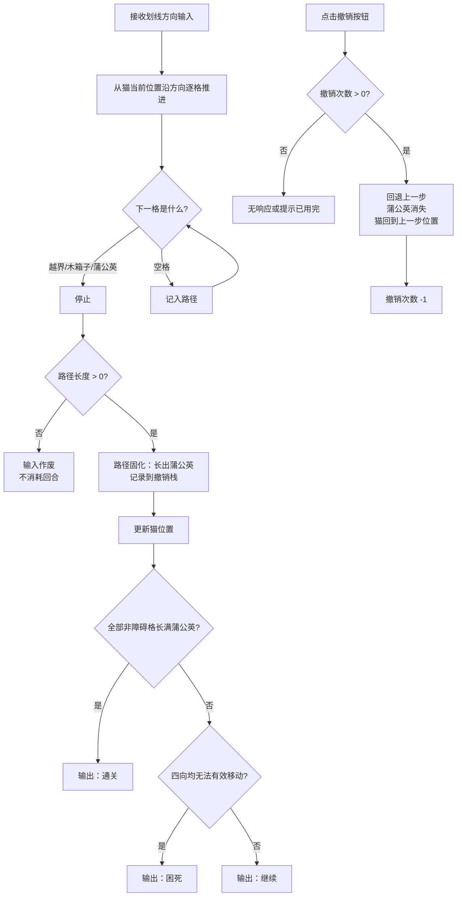

# S01 · 滑行核心系统

> 状态：本文依据 `S01_slide_core/analysis.md` 推导，analysis 全部问题块状态为 `user_confirmed`，**本文已定稿**。
> 上游约束：`02_architecture/design.md` 目录映射与架构铁律。

## 设计目的

目的不是"做一个贪吃蛇"，而是**用最少的规则，造出一个可计算的、可批量生产的空间谜题内核**。

玩家应该感到：

1. 我划一个方向，猫咪就一路滑到撞墙——这个距离不是我决定的，是这张图决定的。所以我在选路线，不是在练操作。
2. 我走过的每一格都长出了蒲公英，再也退不回去。所以每次划线之前，我都会想一秒。
3. 蒲公英既是障碍也是武器——我可以故意绕远，用蒲公英造出一个转角，把我本来去不了的地方变成可达。

## 系统范围

**负责：**

- 网格的数据结构与格子状态（草地、木箱子、蒲公英、空气墙）
- 一次划线输入的滑行结算（推进、受阻、停止）
- 路径固化——滑过的空格长出蒲公英
- 通关判定（全部非障碍格长满蒲公英）与困死判定（四向均无法产生有效移动）
- 撤销功能（每关 3 次机会）

**不负责：**

- 关卡从哪来、关卡内容是什么、难度如何分级 → S02 关卡系统
- 关卡进度、解锁判定 → S02 关卡系统
- 任何渲染、动画、音效、UI 反馈 → 执行文档 / 美术文档
- 任何持久化与存档 → S02 关卡系统 / 存档层
- 判断玩家是否"应该"重开、提示下一步 → 不替玩家做任何决定

## 核心循环

## 关键规则

| # | 规则 | 设计理由 / 它解决的问题 |
|---|---|---|
| R1 | **滑行到底**：一次划线 → 沿该方向逐格推进，直到下一格是边界（空气墙）、木箱子或蒲公英 | 这是整个玩法的地基。步长由地形决定，玩家只决定方向 → 失败归因于决策而非操作 |
| R2 | **路径固化**：滑过的空格全部长出蒲公英，不可逆 | 让每一步成为不可逆承诺，制造决策重量；蒲公英数量即进度，消灭了 HUD 的需求 |
| R3 | **蒲公英即墙**：蒲公英视同木箱子，滑行到它前面停下 | 让蒲公英成为双重身份——既是障碍也是可利用的工具，这是策略深度的来源 |
| R4 | **划线 0 格 = 无效输入**：不作废回合，不改变任何状态 | 一条规则覆盖四个场景（边界/木箱子/蒲公英/掉头）；零成本试探，且天然禁止掉头 |
| R5 | **初始只有猫**：起点只有猫（占一格），默认朝向向上 | 教学最干净；关卡数据无需初始朝向字段，减少出错面 |
| R6 | **胜利 = 填满全部非障碍格**：让草地开满蒲公英，不做覆盖率分级，不做星级评价 | 保持谜题纯粹与可计算性（哈密顿路径）；通关即可，无压力 |
| R7 | **失败 = 困死**：存在空格且四向均无法产生有效移动 | 失败完全归因于玩家决策；不提前宣告死局，不替玩家判断 |
| R8 | **无时间限制、无步数限制** | 这是解谜不是操作；压力应来自谜题本身 |
| R9 | **每关 3 次撤销机会**：点击撤销按钮，回退上一步（蒲公英消失，猫回到上一步位置） | 给触屏误操作容错空间；每关限 3 次，不破坏谜题难度 |

### 规则边界表

| 场景 | 行为 | 依据 |
|---|---|---|
| 反向输入（掉头） | 路径 0 格 → 无效输入 | R4（蒲公英即墙的自然推论，**不设独立规则**） |
| 首次输入 | 正常滑行，无蒲公英阻挡 | R5 |
| 撞到边界 | 停在边界前一格，路径有效 | R1 |
| 正对木箱子 | 路径 0 格 → 无效输入 | R4 |
| 长满最后一格蒲公英 | 立即判定通关，不再检查困死 | R6 优先于 R7 |
| 还剩空格但四向皆堵 | 判定困死 | R7 |
| 撤销次数用完 | 撤销按钮不可用或提示"已用完" | R9 |
| 撤销到初始状态 | 撤销栈为空时，撤销按钮不可用 | R9 |

## 撤销机制详解

| 字段 | 含义 / 用途 |
|---|---|
| `undoStack` | 撤销栈，记录每一步的状态快照（猫位置、蒲公英集合） |
| `undoCount` | 剩余撤销次数，初始 3，每撤销一次 -1 |
| `maxUndo` | 每关最大撤销次数，固定为 3 |

撤销流程：
1. 每次成功划线后，将当前状态（猫位置、蒲公英集合）压入撤销栈
2. 点击撤销按钮时，弹出栈顶状态，恢复猫位置，移除最后长出的蒲公英
3. 撤销次数 -1
4. 撤销栈为空或撤销次数为 0 时，撤销功能不可用

## 状态与字段表

| 字段 | 含义 / 用途 |
|---|---|
| `grid` | 二维网格，每格 ∈ { EMPTY, WALL（木箱子）, FLOWER（蒲公英） }。边界为空气墙（隐式存在，不占格子）。由 S02 提供，本系统只读木箱子分布，独占蒲公英的写入权 |
| `catPos` | 猫当前位置 `[x, y]`，初始为关卡起点 |
| `catDirection` | 猫朝向，默认向上（仅用于渲染，不影响规则） |
| `flowerCount` | 已长出的蒲公英数，用于通关判定与进度展示 |
| `totalEmpty` | 本关非障碍格总数（需长出蒲公英的格数），由 S02 的关卡数据给出 |
| `undoStack` | 撤销栈，记录每步状态快照 |
| `undoCount` | 剩余撤销次数，初始 3 |
| `result` | 当前关卡状态 ∈ { PLAYING, WIN, STUCK } |

## 输出接口表

| 输出 | 含义 | 下游消费者 |
|---|---|---|
| `result: WIN` | 本关已填满全部非障碍格 | S02（推进下一关、记录通关） |
| `steps` | 本关使用的步数 | S02（用于排行榜等社交功能） |
| `result: STUCK` | 存在空格且四向均无法有效移动 | 呈现层（困死反馈）、S02（本关重置） |
| `result: PLAYING` | 关卡仍在进行 | 呈现层（只读） |
| `catPos` / `flowerCount` | 当前猫位置与蒲公英数量 | 呈现层（只读，用于渲染） |
| `invalidInput` | 本次输入作废（划线 0 格） | 呈现层（轻微撞击反馈，**禁止置灰或阻止输入**） |
| `undoCount` | 剩余撤销次数 | 呈现层（显示撤销按钮状态） |

**本系统不输出**：命数变化、能力选择、解锁进度、任何持久化数据、星级评价。

## P0 最小闭环

1. 从 S02 取得一张关卡网格，初始化：猫位于起点，默认朝向向上，`result = PLAYING`，`undoCount = 3`，撤销栈为空。
2. 接收一个划线方向输入，从猫位置沿该方向逐格推进直到受阻。
3. 若路径长度 = 0，作废输入，不改变任何状态，回到步骤 2。
4. 若路径长度 > 0，把路径上的空格全部长出蒲公英，更新猫位置，将状态压入撤销栈。
5. 检查是否长满全部非障碍格蒲公英 → 是则输出 `WIN`，结束。
6. 检查四向是否均无法产生有效移动 → 是则输出 `STUCK`，结束。
7. 否则输出 `PLAYING`，回到步骤 2 等待下一次输入。
8. 玩家点击撤销按钮时，若 `undoCount > 0` 且撤销栈非空，回退上一步，`undoCount--`。

## P1 / P2 后置表

| 优先级 | 内容 | 后置原因 |
|---|---|---|
| P1 | 冰块（滑行更远）、传送门等机制变体方块 | 需重做求解器剪枝，且会稀释"滑行填充"的心智 |
| P1 | 多层网格与高低差 | 渲染与可读性挑战大，先验证 2D 逻辑 |
| P2 | 可推动物体 | 大幅增加复杂度与求解器难度 |
| P2 | 动态墙 / 定时机关 | 引入时间维度，与"无时间压力"冲突 |

## 验证标准表

| 目标 | 验证问题 |
|---|---|
| 规则自明 | 玩家在无任何教程文字的情况下，能否通过前 3 关？ |
| 失败归因于决策 | 玩家困死后的主观归因是"我顺序错了"，还是"我手滑了"？ |
| 蒲公英被当作工具而非纯障碍 | 是否存在玩家故意绕远、用蒲公英制造转角的关卡设计？ |
| 无效输入处理自然 | 玩家撞墙时是否理解了"这个方向走不了"，而不觉得是 bug？ |
| 撤销机制是否缓解误操作焦虑 | 玩家是否更少因为误操作而退出关卡？ |
| 困死判定准确 | 是否存在"四向皆堵但系统判为继续"或"仍有活路却判为困死"的案例？（穷举测试） |
| 无性能问题 | 单次滑行结算与困死判定的耗时是否可忽略？（8×10 网格上限） |
| 离线与运行时一致 | 离线工具与运行时是否 import 同一份 `core/` 规则代码？（架构检查项） |
