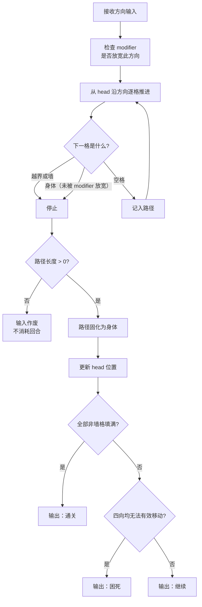

# S01 · 滑行核心系统

> 状态：本文依据 `S01_slide_core/analysis.md` 推导，analysis 状态为 `agent_proposal`，**本文为草案**。
> 上游约束：`02_architecture/design.md` 目录映射与架构铁律。

## 设计目的

目的不是"做一个贪吃蛇"，而是**用最少的规则，造出一个可计算的、可批量生产的空间谜题内核**。

玩家应该感到：

1. 我按下一个方向，猫就一路滑到撞墙——这个距离不是我决定的，是这张图决定的。所以我在选路线，不是在练操作。
2. 我走过的每一格都变成了身体，再也退不回去。所以每次按键之前，我都会想一秒。
3. 我的身体既是障碍也是武器——我可以故意绕远，用身体造出一个转角，把我本来去不了的地方变成可达。

## 系统范围

**负责：**

- 网格的数据结构与格子状态
- 一次方向输入的滑行结算（推进、受阻、停止）
- 路径固化——滑过的空格变成身体
- 通关判定（全部非墙格填满）与困死判定（四向均无法产生有效移动）
- 接收并应用 modifier 参数对象

**不负责：**

- 关卡从哪来、关卡内容是什么、难度如何分级 → S02 关卡系统
- 一次 run 如何组织关卡、命如何消耗、困死后发生什么 → S03 局内进程系统
- 能力是什么、如何三选一、modifier 如何汇总 → S04 能力系统
- 局外解锁、进度持久化、广告位 → S05 局外系统
- 任何渲染、动画、音效、UI 反馈 → 执行文档 / 美术文档
- 任何持久化与存档 → 存档层
- 判断玩家是否"应该"重开、提示下一步 → 不替玩家做任何决定

## 核心循环

## 关键规则

| # | 规则 | 设计理由 / 它解决的问题 |
|---|---|---|
| R1 | **滑行到底**：一次输入 → 沿该方向逐格推进，直到下一格是边界、墙或身体 | 这是整个玩法的地基。步长由地形决定，玩家只决定方向 → 失败归因于决策而非操作 |
| R2 | **路径固化**：滑过的空格全部变为身体，不可逆 | 让每一步成为不可逆承诺，制造决策重量；身体长度即进度，消灭了 HUD 的需求 |
| R3 | **身体即墙**：身体（含尾巴）视同墙，滑行到它前面停下 | 让身体成为双重身份——既是障碍也是可利用的工具，这是策略深度的来源 |
| R4 | **滑行 0 格 = 无效输入**：不作废回合，不改变任何状态 | 一条规则覆盖四个场景（边界/墙/身体/掉头）；零成本试探，且天然禁止掉头 |
| R5 | **初始身体长度为 1**：起点只有猫头，无初始朝向 | 教学最干净；关卡数据无需初始朝向字段，减少出错面 |
| R6 | **胜利 = 填满全部非墙格**：不做覆盖率分级 | 保持谜题纯粹与可计算性（哈密顿路径）；不做"85% 也算过"的妥协 |
| R7 | **失败 = 困死**：存在空格且四向均无法产生有效移动 | 失败完全归因于玩家决策；不提前宣告死局，不替玩家判断 |
| R8 | **无时间限制、无步数限制** | 这是解谜不是操作；压力应来自谜题本身 |
| R9 | **modifier 单向注入**：只接收一个参数对象，不感知能力概念 | 防止规则层被回收层污染；保证离线验证与运行时行为一致 |
| R10 | **modifier 只放宽不收紧**：应用后合法移动集合必为应用前的超集 | 保证「无能力可解 ⇒ 任意能力组合下可解」 |

### 规则边界表

| 场景 | 行为 | 依据 |
|---|---|---|
| 反向输入（掉头） | 路径 0 格 → 无效输入 | R4（身体即墙的自然推论，**不设独立规则**） |
| 长度 = 1 时的首次输入 | 正常滑行，无身体阻挡 | R5 |
| 撞到边界 | 停在边界前一格，路径有效 | R1 |
| 正对墙 | 路径 0 格 → 无效输入 | R4 |
| 填满最后一格 | 立即判定通关，不再检查困死 | R6 优先于 R7 |
| 还剩空格但四向皆堵 | 判定困死 | R7 |
| modifier 允许掉头后反向输入 | 可以掉头（路径长度取决于前方空间） | R10（放宽约束） |
| modifier 允许穿身后撞身体 | 继续穿过身体推进 | R10（放宽约束） |

## 状态与字段表

| 字段 | 含义 / 用途 |
|---|---|
| `grid` | 二维网格，每格 ∈ { EMPTY, WALL, BODY }。由 S02 提供，本系统只读网格的墙分布，独占 BODY 的写入权 |
| `body` | 有序格序列 `[head, ..., tail]`，已固化的身体。初始长度 1 |
| `head` | `body[0]`，滑行的起点 |
| `filledCount` | 已填格数，用于通关判定与进度展示 |
| `totalEmpty` | 本关非墙格总数，由 S02 的关卡数据给出 |
| `lastPath` | 上一次滑行的路径，供撤销类 modifier 使用 |
| `modifiers` | 由 S04 注入的放宽型参数对象（见下表） |
| `result` | 当前关卡状态 ∈ { PLAYING, WIN, STUCK } |

### modifier 参数对象（由 S04 产出，本系统只消费）

| 参数 | 类型 | 作用 | 放宽性 |
|---|---|---|---|
| `undoCount` | 次数 | 可撤销最近 N 次滑行 | ✅ 新增回退选项 |
| `allowReverse` | 布尔 | 允许反向滑行（掉头） | ✅ 新增方向选项 |
| `allowCrossBody` | 布尔 | 允许穿过自己的身体 | ✅ 新增穿越选项 |
| `breakWallCount` | 次数 | 可撞碎墙 N 次 | ✅ 新增破墙选项 |
| `shrinkTailCount` | 格数 | 可从尾部移除 N 格身体 | ✅ 移除障碍 |
| `hintCount` | 次数 | 可查看参考解下一步 N 次（依赖 S02 预存解） | ✅ 纯信息 |
| `rerollCount` | 次数 | 可换一张同难度关卡 N 次（依赖 S02） | ✅ 不改本关规则 |

> 具体数值（次数、布尔的触发条件）归数值表。本表只定义参数语义与放宽性。

## 输出接口表

| 输出 | 含义 | 下游消费者 |
|---|---|---|
| `result: WIN` | 本关已填满全部非墙格 | S03（推进下一关、发放能力机会） |
| `result: STUCK` | 存在空格且四向均无法有效移动 | S03（消耗命、本关重置） |
| `result: PLAYING` | 关卡仍在进行 | 呈现层（只读） |
| `body` / `filledCount` | 当前身体状态与填充进度 | 呈现层（只读，用于渲染猫身） |
| `invalidInput` | 本次输入作废（滑行 0 格） | 呈现层（轻微撞击反馈，**禁止置灰或阻止输入**） |
| `modifierConsumed` | 本次滑行消耗了哪个 modifier 的次数 | S04（扣减能力次数） |
| `lastPath` | 上一次滑行路径 | S04（撤销类能力使用） |

**本系统不输出**：命数变化、能力选择、解锁进度、任何持久化数据。

## P0 最小闭环

1. 从 S02 取得一张关卡网格，初始化：body 长度为 1，位于起点，`result = PLAYING`。
2. 接收一个方向输入，从 head 沿该方向逐格推进直到受阻。
3. 若路径长度 = 0，作废输入，不改变任何状态，回到步骤 2。
4. 若路径长度 > 0，把路径上的空格全部固化为 BODY，更新 head。
5. 检查是否填满全部非墙格 → 是则输出 `WIN`，结束。
6. 检查四向是否均无法产生有效移动 → 是则输出 `STUCK`，结束。
7. 否则输出 `PLAYING`，回到步骤 2 等待下一次输入。
8. 全过程中，若 modifier 被使用（撤销/破墙/缩短尾巴），输出 `modifierConsumed` 供 S04 扣减。

## P1 / P2 后置表

| 优先级 | 内容 | 后置原因 |
|---|---|---|
| P1 | 冰块（滑行更远）、传送门等机制变体方块 | 需重做求解器剪枝，且会稀释"滑行填充"的心智 |
| P1 | 多层网格与高低差 | 渲染与可读性挑战大，先验证 2D 逻辑 |
| P1 | modifier：滑行结果预测（预览） | 与呈现契约第 2 条（不替玩家解题）冲突，需单独论证是否为玩家主动选择的能力 |
| P2 | 可推动物体 | 大幅增加复杂度与求解器难度 |
| P2 | 动态墙 / 定时机关 | 引入时间维度，与"无时间压力"冲突 |
| P2 | modifier：改变滑行距离 | 已被证明**不满足放宽性**（可能让玩家错过转角），除非能重新证明，否则不纳入 |

## 验证标准表

| 目标 | 验证问题 |
|---|---|
| 规则自明 | 玩家在无任何教程文字的情况下，能否通过前 3 关？ |
| 失败归因于决策 | 玩家困死后的主观归因是"我顺序错了"，还是"我手滑了"？ |
| 身体被当作工具而非纯障碍 | 是否存在玩家故意绕远、用身体制造转角的关卡设计？ |
| 无效输入处理自然 | 玩家撞墙时是否理解了"这个方向走不了"，而不觉得是 bug？ |
| modifier 不污染核心 | S01 代码中是否出现任何能力名称或能力判断分支？（代码审查硬指标） |
| modifier 严格放宽 | 离线校验：每个 modifier 单独与组合应用后，无能力状态下的参考解是否仍然成立？ |
| 离线与运行时一致 | 离线工具与运行时是否 import 同一份 `core/` 规则代码？（架构检查项） |
| 困死判定准确 | 是否存在"四向皆堵但系统判为继续"或"仍有活路却判为困死"的案例？（穷举测试） |
| 无性能问题 | 单次滑行结算与困死判定的耗时是否可忽略？（8×10 网格上限） |
