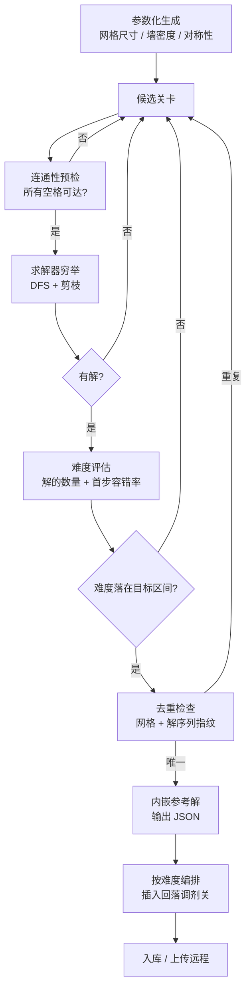

# S02 · 关卡系统

> 状态：本文依据 `S02_level/analysis.md` 推导，analysis 状态为 `agent_proposal`，**本文为草案**。
> 上游约束：`02_architecture/design.md` 目录映射与数据所有权约定。

## 设计目的

目的不是"做一堆关卡"，而是**建立一条可批量生产且 100% 可验证的内容流水线**。

玩家应该感到：

1. 每一关都是新的，但我从来没遇到过"根本解不开"的关——我卡住了，那是我还没想清楚。
2. 难度在爬，但不是越走越长那种累；偶尔会突然来一关短的，让我喘口气。
3. 我卡在同一关转圈的时候，游戏会告诉我"这个方向可能不对"，而不是让我耗到命都没了。

## 系统范围

**负责：**

- 关卡数据结构定义与编码规范
- 内置关卡（教学与首章）的读取
- 远程关卡的按需加载、本地缓存、失败降级
- 章节组织与关卡序列编排
- 难度分级（解的数量 + 首步容错率）
- **离线侧**：关卡生成器与求解器工具链（node 脚本）
- 产出内嵌参考解的关卡 JSON

**不负责：**

- 关卡内的滑行规则与胜负判定 → S01 滑行核心系统
- 一次 run 如何排列关卡、什么时候要下一关 → S03 局内进程系统
- 能力的任何内容、modifier 如何应用 → S04 能力系统
- 章节进度的**解锁判定**（谁有权玩到哪一章）→ S05 局外系统
- 关卡的美术表现、网格如何渲染 → 执行文档 / 美术文档
- 玩家进度、通关记录的持久化 → 存档层
- 运行时求解（架构已否决）→ 无

## 核心循环（离线生产流水线）

### 求解器剪枝策略

| 剪枝 | 原理 | 收益 |
|---|---|---|
| 死腔剪枝 | 若某次移动后出现孤立空格群，且其大小 < 当前可达路径能填充的最小段长 → 必死 | 砍掉绝大部分分支 |
| 奇偶性剪枝 | 网格黑白棋盘染色，某些布局下黑白格数差决定哈密顿路径的存在性 | O(1) 数学剪枝 |
| 记忆化 | `(已填位图, head位置, 方向)` 哈希缓存 | 对小网格极有效 |
| 对称性剪枝 | 首步去掉旋转对称的等价方向 | 约 4 倍加速 |

**网格尺寸硬上限：8×10。** 超过此量级穷举求解指数爆炸，需改用启发式——而启发式无法保证"100% 可解"，会摧毁内容护城河。

## 关键规则

| # | 规则 | 设计理由 / 它解决的问题 |
|---|---|---|
| R1 | **生成的关卡必须 100% 有解**，且附带一条验证过的参考解 | 玩家绝不能遇到解不开的关卡——这是信任的底线 |
| R2 | **关卡在「无能力」状态下必须可解** | 能力与关卡解耦；配合"modifier 只放宽"，保证任意能力组合下都可解 |
| R3 | **难度指标 = 解的数量（主）+ 首步容错率（辅）**，不使用步数 | 拆解实证：步数与难度弱相关（37% 回落率） |
| R4 | **网格尺寸锁定 5×6 ~ 8×10，不随难度递增** | 难度靠墙的分布（分支稀缺度），不靠放大网格；大网格会让玩家无法脑内推演 |
| R5 | **关卡序列不得单调升序**，须按约 1/3 比例插入回落调剂关 | 拆解实证：Longcat 第 15/40/47 关是刻意的呼吸阀，防高压期集中流失 |
| R6 | **前 20–30 关手工设计并内置**，其余程序生成并远程加载 | 教学与第一印象不能赌生成器；同时满足 4MB 包体与提审约束 |
| R7 | **关卡数据所有权独占**，其他系统只能通过 ID 请求 | 架构铁律；防止网格内容被多处持有导致一致性问题 |
| R8 | **加载器统一接口**，上层不感知内置/远程差异 | 降低调用方复杂度，便于将来调整切分点 |
| R9 | **离线工具与运行时共用 `core/` 规则代码** | 保证验证行为与游玩行为完全一致 |
| R10 | **单关参考解步数上限 22 步** | 超过则玩家无法脑内推演，游戏从解谜退化为试错 |

### 规则边界表

| 场景 | 行为 | 依据 |
|---|---|---|
| 远程加载失败且有本地缓存 | 使用缓存 | R8 |
| 远程加载失败且无缓存 | 回退内置关卡池（策略细节归执行文档） | R8 |
| 生成器产出无解关卡 | 丢弃，重新生成 | R1 |
| 生成器产出难度超标关卡 | 丢弃，重新生成 | R3 |
| 生成器产出的关卡与已有重复 | 丢弃，重新生成（指纹去重） | 流水线 |
| 玩家请求超出已解锁章节 | 拒绝，交由 S05 解锁判定 | 本系统不管解锁 |
| 关卡参考解步数 > 22 | 判定为关卡设计失败，不入库 | R10 |

## 状态与字段表

### 关卡 JSON 结构

| 字段 | 类型 | 含义 / 用途 |
|---|---|---|
| `id` | number | 关卡唯一 ID |
| `size` | `[w, h]` | 网格尺寸，限定在 5×6 ~ 8×10 |
| `grid` | string | 网格编码，字符串形式（`#`=墙，`.`=空格，`S`=起点），长度 = w × h |
| `start` | `[x, y]` | 起点坐标（初始 body 长度 1，无朝向字段——见 S01 R5） |
| `solution` | string | 参考解，方向序列（如 `"URDLU"`），用于提示与偏离检测 |
| `meta.solutionCount` | number | 解的总数，难度主指标 |
| `meta.firstMoveTolerance` | number | 首步容错率（0–1），难度辅指标 |
| `meta.difficulty` | number | 加权难度评分 |
| `meta.source` | enum | `handmade` / `generated` |
| `meta.tags` | string[] | 标签：`tutorial` / `boss` / `breather`（调剂关）/ `normal` |

### 系统运行时状态

| 字段 | 含义 / 用途 |
|---|---|
| `currentLevel` | 当前加载的关卡数据（网格 + 元数据 + 参考解） |
| `cache` | 已加载过的远程关卡本地缓存 |
| `chapterIndex` | 当前章节索引（关卡序列的组织单位） |

## 输出接口表

| 输出 | 含义 | 下游消费者 |
|---|---|---|
| `levelData` | 网格 + 起点 + 元数据 | S01（滑行核心的输入） |
| `referenceSolution` | 参考解方向序列 | S04（提示类 modifier 消费）、S05（每日挑战比步数） |
| `difficulty` / `tags` | 难度评分与标签 | S03（编排关卡序列、识别 Boss/调剂关） |
| `levelLoaded` / `loadFailed` | 加载结果事件 | 呈现层（加载态） |
| `rerollLevel()` | 换一张同难度关卡（供 S04 的 reroll modifier 调用） | S04 |

**本系统不输出**：命数、能力、解锁状态、任何玩家进度。

## P0 最小闭环

1. 内置 20–30 关手工关卡（含 5 关教学），打包进小游戏主包。
2. 离线生成器按参数产出候选关卡，经连通性预检 + 求解器验证有解。
3. 求解器同时算出解的数量与首步容错率，筛出落在目标难度区间的关卡。
4. 通过的关卡内嵌参考解，输出 JSON，去重后入库。
5. 编排算法按难度曲线排列，并按约 1/3 比例插入回落调剂关。
6. 关卡 JSON 上传远程，小游戏按章节懒加载并本地缓存。
7. 上层通过统一接口 `requestLevel(id)` 取关，不感知内置/远程差异。

## P1 / P2 后置表

| 优先级 | 内容 | 后置原因 |
|---|---|---|
| P1 | 每日挑战关卡池（全服同题） | 依赖用户基数与后端/云开发 |
| P1 | 机制变体方块（冰块、传送门）的求解器支持 | 需重做剪枝规则，先验证基础方块 |
| P1 | 多章节主题差异（视觉与墙型风格） | 内容量足够后再做 |
| P2 | 关卡编辑器 + UGC 分享 | 重功能，依赖用户基数 |
| P2 | 大网格（>8×10）与启发式求解 | 会失去"100% 可解"的保证，需重新论证 |
| P2 | 动态难度（按玩家表现调整后续关卡） | 与"关卡必须预验证"冲突 |

## 验证标准表

| 目标 | 验证问题 |
|---|---|
| 关卡 100% 可解 | 生成的关卡中，是否存在求解器验证通过但实际无解的案例？（离线全量复验） |
| 无能力可解 | 任意关卡在 modifier 全空状态下，参考解是否成立？ |
| 难度指标有效 | 玩家实际的重开次数，是否与首步容错率负相关？ |
| 难度曲线有节奏 | 关卡序列中是否存在约 1/3 的回落调剂关？玩家是否在高压关后表现出可观测的疲劳缓解？ |
| 单关时长合意 | 单关时长中位数是否落在 45–90 秒？ |
| 步数不超上限 | 所有入库关卡的参考解步数是否 ≤ 22？ |
| 加载体验无损 | 弱网/离线时，玩家能否立即进入前几关？ |
| 数据所有权不泄漏 | 除 S02 外，是否有系统持有网格内容？（代码审查项） |
| 离线与运行时一致 | 生成器是否 import 与运行时相同的 `core/` 规则代码？（架构检查项） |
