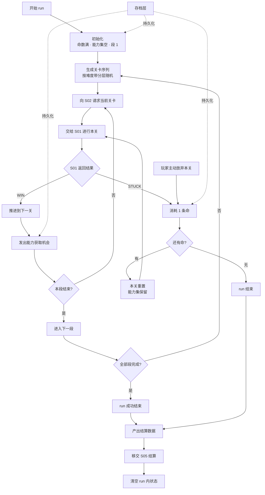

# S03 · 局内进程系统（run）

> 状态：本文依据 `S03_run/analysis.md` 推导，analysis 状态为 `agent_proposal`，**本文为草案**。
> 上游约束：`02_architecture/design.md` 目录映射与「因果单向」铁律。

## 设计目的

目的不是"给关卡排个队"，而是**把 Longcat 缺失的「失败回收」补上——让玩家困死后想的不是"我不玩了"，而是"还有八条命"**。

玩家应该感到：

1. 我困死了一次，但只掉了一条命，我拿到的能力一个都没少——重开这关我肯定能过。
2. 我知道自己走到第几段了，也知道上一次走到第几段——我在变强。
3. 我中途退出去回个消息，回来时这次 run 还在原地等我，一条命都没少。

## 系统范围

**负责：**

- run 的初始化（命数、空能力集、起始段）
- run 关卡序列的生成（按难度带分层随机）
- 接收 S01 的关卡结果，执行回收（通关推进 / 困死消耗命 / 放弃消耗命）
- run 结束判定（命耗尽 / 通关全部段）
- run 结算数据的产出
- run 状态的持久化（供跨会话续玩）

**不负责：**

- 滑行规则与关卡内的胜负判定 → S01 滑行核心系统
- 关卡数据从哪来、难度如何分级 → S02 关卡系统
- 能力池内容、三选一如何生成、modifier 如何汇总 → S04 能力系统
- 局外解锁的判定（解锁了什么能力）→ S05 局外系统
- run 结算的 UI 呈现 → 执行文档 / 美术文档
- 存档的物理写入 → 存档层（本系统只提供状态快照）

## 核心循环

## 关键规则

| # | 规则 | 设计理由 / 它解决的问题 |
|---|---|---|
| R1 | **困死消耗 1 条命，本关重置，能力集完整保留** | 接住失败。能力只增不减 → 重开时比上次更强 → 形成正反馈 |
| R2 | **主动放弃本关也消耗 1 条命** | 提供逃生阀（避免卡死在同一关），但有代价，防止玩家无脑跳过难题 |
| R3 | **命耗尽 → run 结束**；通关全部段 → run 成功结束 | run 有明确终点，才有"走多远"的张力 |
| R4 | **run 内状态在每次变化时立即持久化** | 微信生态最致命的流失是被打断后再也回不来；这是留存设计的核心，不是便利功能 |
| R5 | **关内进度（body 形状）不持久化**，恢复时本关重置且不消耗命 | 存档结构简单；一关只需 30 秒–2 分钟重走；副作用是天然阻止退出重进规避困死 |
| R6 | **关卡序列按难度带分层随机**，段内按「递增 + 调剂关」编排 | 兼顾"每次不同"（段内随机）与"我在进步"（段作为进度刻度） |
| R7 | **玩家可感知的进度刻度是「段」而非「关」** | 段是稳定的心理锚点；关卡是随机的，不适合做进度感 |
| R8 | **因果单向**：本系统只消费 S01 的结果，绝不反向影响滑行规则 | 架构铁律。命的消耗与能力发放都在回收层，不污染规则层 |
| R9 | **run 结束只清空 run 内状态**（命、能力集、关卡进度）；局外进度分毫不动 | 失败 = 少赚，不是毁档 |
| R10 | **每关通关后发出一次「能力获取机会」** | 能力成长的节拍；也是 run 推进的正反馈节点 |

### 规则边界表

| 场景 | 行为 | 依据 |
|---|---|---|
| 困死且还有命 | 消耗 1 命，本关重置，能力保留 | R1 |
| 困死且命 = 0 | run 结束，进入结算 | R3 |
| 玩家主动放弃 | 消耗 1 命，跳过至下一关 | R2 |
| 玩家中途退出 | run 状态已持久化；下次回到本关起点，命数不变 | R4 + R5 |
| 通关一关 | 推进下一关 + 发出能力获取机会 | R10 |
| 通关某段最后一关 | 进入下一段，重新生成该段关卡序列 | R6 |
| 通关全部段 | run 成功结束，进入结算 | R3 |
| 关卡池不足以填充某段 | 放宽难度区间或从相邻段抽取（策略归执行文档） | R6 的降级保证 |

## 状态与字段表

| 字段 | 含义 / 用途 | 归属 |
|---|---|---|
| `lives` | 当前剩余命数，run 内状态，run 结束清空 | run 内 |
| `stageIndex` | 当前段索引，玩家的进度刻度 | run 内 |
| `levelIndexInStage` | 当前段内的关卡序号 | run 内 |
| `currentLevelId` | 当前关卡 ID（向 S02 请求用） | run 内 |
| `levelSequence` | 本 run 已生成的关卡序列（按段组织） | run 内 |
| `abilitySet` | 本 run 已获得的能力集合（由 S04 写入，本系统只读持有） | run 内，S04 修改 |
| `runStats` | 本 run 的统计：通关关数、困死次数、最长猫长度 | run 内 |
| `runState` | ∈ { ACTIVE, ENDED_SUCCESS, ENDED_FAILED } | run 内 |

> 命数与段数的具体数值归数值表。本表只定义字段语义与 run 内/局外归属。

## 输出接口表

| 输出 | 含义 | 下游消费者 |
|---|---|---|
| `levelRequest` | 请求下一关（携带难度带与段信息） | S02 关卡系统 |
| `abilityOpportunity` | 一次能力获取机会（每关通关时发出） | S04 能力系统 |
| `runStateSnapshot` | run 状态快照（供持久化） | 存档层 |
| `settlement` | run 结算数据：到达段数、通关关数、最长猫长度、能力组合、困死局面 | S05 局外系统 |
| `stageProgress` | 当前段进度 | 呈现层（只读） |
| `livesChanged` | 命数变化事件 | 呈现层（只读） |

**本系统不输出**：任何关卡规则、任何能力效果、任何局外解锁判定。

## P0 最小闭环

1. 玩家开始一次 run：命数初始化为满，能力集为空，进入第 1 段。
2. 系统按第 1 段的难度带随机抽取关卡，编排为本段序列（含调剂关），向 S02 请求第一关。
3. S01 进行本关，返回结果。
4. 若通关：推进下一关，发出一次能力获取机会；若本段结束则进入下一段。
5. 若困死：消耗 1 条命，本关重置，能力集保留，重新进行本关。
6. 若玩家中途退出：run 状态已持久化；下次进入回到本关起点，命数不变。
7. 重复 3–6，直到命耗尽（失败结束）或通关全部段（成功结束）。
8. 产出结算数据移交 S05，清空 run 内状态。

## P1 / P2 后置表

| 优先级 | 内容 | 后置原因 |
|---|---|---|
| P1 | 段间路线选择（2–3 个候选段） | 增加决策负担，先验证基础 run 结构 |
| P1 | 段 Boss 关（特殊标记 + 额外奖励） | 依赖内容量与能力池规模 |
| P1 | run 内的复活（看广告 +命） | 依赖广告接入与变现设计 |
| P2 | 无尽模式（无段上限） | 与"关卡必须预验证"冲突，需重新论证 |
| P2 | run 内事件（随机遭遇、商店） | 会稀释核心解谜体验 |
| P2 | 多人竞速 run | 依赖用户基数 |

## 验证标准表

| 目标 | 验证问题 |
|---|---|
| 失败被接住 | 玩家困死后的第一反应是"重开一次"，还是"退出游戏"？ |
| run 有张力 | 玩家在命剩 1–2 条时，是否表现出可观测的决策变化（更保守、更愿放弃）？ |
| 进度可感知 | 玩家能否说出"我这次走到第几段"？ |
| 中断无损 | 中途退出再进入，命数、能力集、段进度是否完全恢复？ |
| 难度曲线受控 | 分层随机是否避免了"连抽三关 Boss"的情况？（离线模拟检验） |
| 重玩有新鲜感 | 同一玩家连续两次 run，第 1 段抽到的关卡重复率是否在可接受范围？ |
| 因果单向 | 本系统是否存在任何反向影响 S01 规则的代码路径？（代码审查项） |
| 放弃不被滥用 | 主动放弃的使用频率是否健康，而非成为规避难题的默认手段？ |
