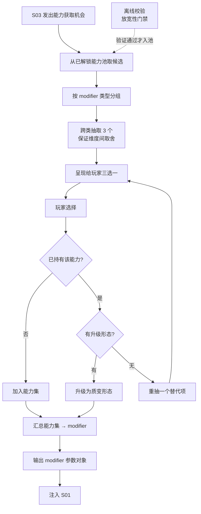

# S04 · 能力系统

> 状态：本文依据 `S04_ability/analysis.md` 推导，analysis 状态为 `agent_proposal`，**本文为草案**。
> 上游约束：`02_architecture/design.md` 目录映射 + 架构铁律「modifier 必须放宽约束 / 单向注入 / 核心零能力分支」。

## 设计目的

目的不是"给玩家发奖励"，而是**让同一个谜题在不同能力组合下变成不同的题——这是本项目全部差异化的支点**。

玩家应该感到：

1. 这一局我拿了"允许掉头"，上一局没有——同一张图，我居然能用完全不同的路线解开。
2. 三个选项之间没有标准答案：要规则突破（更简单），还是要容错（更保险）？这次我想赌一把。
3. 我从来没因为拿了某个能力而让关卡变得更难——能力只会让我多出选择，永远不会堵死我。

## 系统范围

**负责：**

- 能力池管理（已解锁能力集合）
- 三选一 offer 的生成（按类型分组，跨类抽取）
- 已选能力集的维护与升级逻辑
- 把能力集折算（汇总）成 modifier 参数对象
- modifier 放宽性的离线校验（纳入离线工具链）

**不负责：**

- modifier 在滑行中如何被执行 → S01 滑行核心系统（本系统只产出参数，不参与结算）
- 什么时候给能力机会、run 何时结束 → S03 局内进程系统
- 哪些能力已解锁、解锁条件是什么 → S05 局外系统
- 命数的增减 → S03
- 关卡内容与参考解（提示类能力的数据来源）→ S02
- 能力图标、三选一界面的 UI → 执行文档 / 美术文档

## 核心循环

## 关键规则

| # | 规则 | 设计理由 / 它解决的问题 |
|---|---|---|
| R1 | **能力只做规则修正，不做数值加成** | 概念定稿。本游戏无数值系统——引入数值等于引入平衡工作量黑洞 |
| R2 | **所有 modifier 必须是放宽约束型**：应用后合法移动集合 ⊇ 应用前 | 保证「无能力可解 ⇒ 任意能力组合下可解」，这是关卡可信度的数学基础 |
| R3 | **三选一跨类抽取**（规则突破 / 容错 / 信息 / 换关） | 保证每次选择是维度间的取舍，而非"撤销 1 次 vs 撤销 2 次"的伪选择 |
| R4 | **默认不可叠加**；核心能力有质变型升级形态 | 次数叠加 = 数值成长（违反 R1）；升级必须改变规则的形状，不是累加数字 |
| R5 | **modifier 单向注入**：本系统只产出一个参数对象，S01 不感知能力概念 | 架构铁律。防止规则层被回收层污染 |
| R6 | **放宽性离线校验是入池门禁**：逐个验证，非组合穷举 | 放宽性可复合传递（超集复合仍是超集），故 N 个能力只需 N 次验证 |
| R7 | **能力集在 run 内累积，run 结束清空** | run 内状态；局外只保留"哪些能力已解锁" |
| R8 | **能力不影响关卡的可解性**——能力只让关卡变简单，绝不是通关前提 | 关卡与能力解耦（S02 R2 的对应约束） |
| R9 | **池子不足三类时降级为随机**，不阻塞流程 | 保证流程健壮性 |

### modifier 参数表

| 参数 | 类型 | 作用 | 类别 | 放宽性 |
|---|---|---|---|---|
| `undoCount` | 次数 | 可撤销最近 N 次滑行 | 容错 | ✅ 新增回退选项 |
| `shrinkTailCount` | 格数 | 可从尾部移除 N 格身体 | 容错 | ✅ 移除障碍 |
| `allowReverse` | 布尔 | 允许反向滑行 | 规则突破 | ✅ 新增方向选项 |
| `allowCrossBody` | 布尔 | 允许穿过自己的身体 | 规则突破 | ✅ 新增穿越选项 |
| `breakWallCount` | 次数 | 可撞碎墙 N 次 | 规则突破 | ✅ 新增破墙选项 |
| `hintCount` | 次数 | 可查看参考解下一步 N 次 | 信息 | ✅ 纯信息，不改变移动集合 |
| `rerollCount` | 次数 | 可换一张同难度关卡 N 次 | 换关 | ✅ 不改变本关移动集合 |

> 具体数值（次数、触发条件、哪些能力有升级形态）归数值表与能力表。本表只定义参数语义、类别与放宽性。

### 规则边界表

| 场景 | 行为 | 依据 |
|---|---|---|
| 三选一中抽到已持有且无升级形态的能力 | 重抽一个替代项 | R4 |
| 三选一中抽到已持有且有升级形态的能力 | 仍作为选项展示（玩家可选择升级） | R4 |
| 能力池不足三类 | 降级为纯随机抽取 | R9 |
| 某 modifier 离线校验未通过 | 不得进入能力池（门禁） | R6 |
| 玩家已持有全部能力 | 三选一只展示升级项（或降级为小额资源，归数值表） | R4 |
| 能力效果需要参考解（提示类） | 向 S02 请求参考解 | 本系统不持有关卡数据 |

## 状态与字段表

| 字段 | 含义 / 用途 | 归属 |
|---|---|---|
| `unlockedPool` | 已解锁能力集合（局外状态，由 S05 写入，本系统只读） | 局外，S05 修改 |
| `offerOptions` | 当前三选一的三个候选 | 临时 |
| `abilitySet` | 本 run 已持有的能力及其等级 | run 内，本系统修改 |
| `modifiers` | 由 `abilitySet` 汇总出的参数对象 | run 内，本系统修改 |
| `consumedCounters` | 次数类 modifier 的已消耗计数（接收 S01 的 `modifierConsumed` 事件扣减） | run 内，本系统修改 |

## 输出接口表

| 输出 | 含义 | 下游消费者 |
|---|---|---|
| `modifiers` | 汇总后的放宽型参数对象 | S01 滑行核心系统（唯一消费者） |
| `offerOptions` | 三选一候选列表 | 呈现层（只读展示） |
| `abilitySet` | 当前 run 的能力集 | S03（run 状态快照的一部分）、呈现层（只读） |
| `rerollRequest` | 换一张同难度关卡的请求 | S02 关卡系统 |
| `hintRequest` | 获取参考解下一步的请求 | S02 关卡系统 |

**本系统不输出**：任何滑行规则、任何命数变化、任何局外解锁。

## P0 最小闭环

1. S03 因通关一关而发出能力获取机会。
2. 本系统从已解锁能力池取候选，按 modifier 类型分组。
3. 跨类抽取 3 个能力，呈现给玩家三选一（池子不足时降级为随机）。
4. 玩家选择一个；若已持有则走升级逻辑（无升级形态则重抽）。
5. 能力加入 `abilitySet`，重新汇总出 `modifiers` 参数对象。
6. 把 `modifiers` 注入 S01，下一关起生效。
7. 离线工具链对每个 modifier 单独跑放宽性校验，未通过者不得入池。

## P1 / P2 后置表

| 优先级 | 内容 | 后置原因 |
|---|---|---|
| P1 | 全部能力的质变型升级形态 | 设计工作量大，MVP 只给 3–5 个核心能力做 |
| P1 | 提示类能力的实际接入（依赖 S02 参考解） | 需先完成参考解内嵌与偏离检测 |
| P1 | 能力间的协同/冲突关系（如"允许穿身" + "缩短尾巴"的组合技） | 需先验证基础能力池 |
| P1 | 滑行结果预览类能力 | 与呈现契约第 2 条冲突，需单独论证 |
| P2 | 能力构筑树 / 套装联动 | 明确违反"不做重度构筑"的概念定稿 |
| P2 | 玩家自定义能力 | 依赖 UGC 体系 |

## 验证标准表

| 目标 | 验证问题 |
|---|---|
| 能力真的影响决策 | 同一关卡在挂不同能力时，玩家的路径选择是否出现可观测差异？ |
| 三选一是真取舍 | 玩家在三个选项间的选择分布是否分散，而非集中在一个"标准答案"？ |
| 能力不构成通关前提 | 任意关卡在 modifier 全空状态下是否可解？ |
| modifier 严格放宽 | 离线校验：每个 modifier 单独应用后，合法移动集合是否单调不减？ |
| 能力不做数值膨胀 | 每个能力能否用一句话说清"它改变了哪条规则"，而不需要引用任何数字？ |
| 核心零能力分支 | S01 代码中是否出现任何能力名称？（代码审查硬指标） |
| 玩家未被能力削弱 | 是否存在玩家反馈"拿了某个能力反而更难了"的情况？（应恒为 0） |
| 能力集在 run 结束后清空 | run 结束后，新 run 的能力集是否为空？ |
