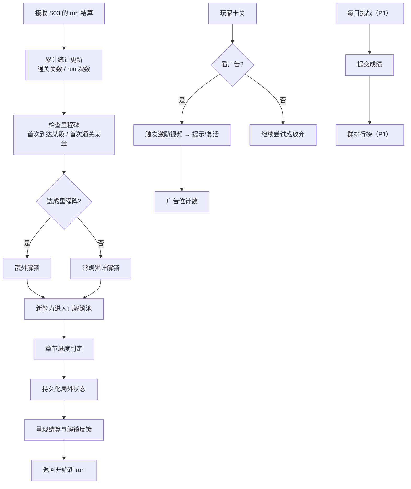

# S05 · 局外系统

> 状态：本文依据 `S05_meta/analysis.md` 推导，analysis 状态为 `agent_proposal`，**本文为草案**。
> 上游约束：`02_architecture/design.md` 目录映射（MVP 只做：进度持久化 / 能力池解锁 / 广告位预留）。

## 设计目的

目的不是"做一个成就系统"，而是**给玩家一个"明天还回来"的理由，以及一条"我在变强"的可见曲线**。

玩家应该感到：

1. 这次 run 虽然没走多远，但我的解锁进度条又前进了一格——没白玩。
2. 我解锁了新能力，那张我早就通关的老关卡，这次换个能力重玩居然是另一种解法。
3. 我卡死的时候，游戏给我一个台阶（提示/复活），而不是逼我做"硬想还是放弃"的二选一。

## 系统范围

**负责：**

- 局外进度的定义与持久化（已解锁能力池、章节进度、累计统计、历史最佳）
- 把 run 结算转化为解锁推进（累计进度 + 里程碑）
- 广告位的预留与触发点管理
- 微信社交能力的接入点（P1：每日挑战、群排行榜、分享）

**不负责：**

- run 内的任何状态（命、能力集、当前关卡）→ S03 局内进程系统
- 单次 run 的推进规则与结算数据的产出 → S03
- 能力的具体效果与 modifier → S04 能力系统（本系统只管"哪些能力已解锁"）
- 关卡内容与章节内容本身 → S02 关卡系统（本系统只管"章节是否解锁"）
- 存档的物理写入 → 存档层（本系统只提供状态快照）
- 广告 SDK 的实际接入与商业化策略 → 执行文档

## 核心循环



## 关键规则

| # | 规则 | 设计理由 / 它解决的问题 |
|---|---|---|
| R1 | **局外成长主体是能力池解锁** | 能力池解锁同时是**内容复用机制**——新能力让旧关卡产生新解法，这是它优于章节/皮肤/排行的根本原因 |
| R2 | **解锁由累计进度驱动**（累计通关关数 / run 次数），不由单次 run 表现驱动 | 避免马太效应：按单次表现解锁会惩罚最需要帮助的新手（走不远→解锁慢→更走不远） |
| R3 | **里程碑提供额外解锁** | 在稳定节奏之外制造高光时刻，且不影响基础节奏的公平性 |
| R4 | **局外进度一经获得立即入档，不可被任何失败剥夺** | "失败 = 少赚，不是毁档"的最终落地点 |
| R5 | **失败的 run 也有产出** | 玩家 run 失败后仍看到进度条前进 → "这次没白玩" |
| R6 | **MVP 只做激励视频，不做强制插屏与常驻 Banner** | 强制插屏打断解谜心流；常驻 Banner 侵占视野、伤害全图可读性 |
| R7 | **广告位与救助机制合一**：提示、复活、双倍解锁 | 玩家看广告换来的是他此刻正需要的东西；零打扰且与"接住失败"一致 |
| R8 | **本系统独占局外状态的修改权** | 架构铁律（数据所有权唯一）；谁解锁了什么只由本系统说了算 |
| R9 | **章节进度只管"是否解锁"，不管章节内容** | 内容归 S02，本系统不做内容判断 |

### 规则边界表

| 场景 | 行为 | 依据 |
|---|---|---|
| run 失败结算 | 累计进度依然推进，可触发常规解锁 | R2 + R5 |
| run 成功结算 | 累计进度推进 + 可能触发里程碑 | R3 |
| 已解锁全部能力 | 解锁反馈转为其他奖励形式（归数值表） | R1 的边界 |
| 玩家看广告 | 触发对应救助（提示 / 复活 / 双倍解锁） | R7 |
| 玩家拒绝广告 | 不惩罚，正常继续 | R7 |
| 存档版本升级 | 由存档层做迁移，本系统只提供状态结构 | 本系统不管物理存储 |
| 章节解锁 | 本系统判定是否解锁，向 S02 请求该章内容 | R9 |

## 状态与字段表

| 字段 | 含义 / 用途 | 归属 |
|---|---|---|
| `unlockedAbilities` | 已解锁能力集合 | 局外，本系统修改（S04 只读） |
| `unlockedChapters` | 已解锁章节集合 | 局外，本系统修改 |
| `totalLevelsCleared` | 累计通关关数（解锁进度的主要驱动） | 局外 |
| `totalRuns` | 累计 run 次数 | 局外 |
| `milestones` | 已达成里程碑集合 | 局外 |
| `bestStage` | 历史最远段数 | 局外 |
| `longestCat` | 历史最长的猫（长度 + 对应关卡 ID） | 局外 |
| `adCounters` | 广告触发计数（提示 / 复活 / 双倍解锁） | 局外 |
| `dailyChallenge` | 每日挑战记录（P1） | 局外 |
| `unlockProgress` | 距离下一次解锁的进度（供呈现层展示进度条） | 局外，派生 |

> 解锁所需的累计阈值、里程碑定义、广告频次上限归数值表。本表只定义字段语义与归属。

## 输出接口表

| 输出 | 含义 | 下游消费者 |
|---|---|---|
| `unlockedAbilities` | 已解锁能力集合 | S04 能力系统（决定三选一的可抽范围） |
| `unlockedChapters` | 已解锁章节 | S02 关卡系统（决定可请求的关卡范围） |
| `metaStateSnapshot` | 局外状态快照 | 存档层 |
| `unlockProgress` | 解锁进度（用于结算界面展示） | 呈现层（只读） |
| `adTrigger` | 广告触发点（提示/复活/双倍解锁） | 执行层广告模块 |
| `dailyChallengeResult` | 每日挑战成绩（P1） | 排行榜模块（P1） |

**本系统不输出**：任何 run 内状态、任何滑行规则、任何能力效果、任何关卡内容。

## P0 最小闭环

1. 接收 S03 移交的 run 结算数据（到达段数、通关关数、最长猫、能力组合）。
2. 更新累计统计（累计通关关数、run 次数、历史最佳）。
3. 检查是否达成里程碑 → 达成则额外解锁。
4. 按累计进度判定常规解锁 → 新能力进入 `unlockedAbilities`。
5. 判定章节解锁，更新 `unlockedChapters`。
6. 持久化全部局外状态（不可剥夺）。
7. 呈现结算与解锁反馈（到达段数、最长猫、能力组合回顾、本次解锁、困死局面截图、历史对比）。
8. 预留三个广告触发点：提示、复活、双倍解锁（MVP 只预留位置与计数，实际接入归 P1）。

## 差异化设计：每日挑战与好友排行榜

### 核心决策

**保持玩法不变，通过局外社交竞争实现差异化。**

不引入角色数值成长、皮肤装饰、付费道具等可能污染核心玩法的元素。差异化完全由每日挑战和好友排行榜承担。

### 每日挑战设计

```
规则：

1. 固定种子
   - 每天 00:00 刷新
   - 使用日期作为随机种子（如 2026-09-04）
   - 所有玩家玩相同的 5 关

2. 关卡配置
   - 5 关，难度递增
   - 关卡 1-2：简单（6x6，5-7 步）
   - 关卡 3-4：中等（8x8，8-12 步）
   - 关卡 5：困难（10x10，13-18 步）

3. 能力限制
   - 所有玩家初始能力相同（已解锁的全部可用）
   - 每关开始时的三选一选项也固定
   - 确保公平性

4. 排名规则
   - 第一优先级：通关关数（1-5）
   - 第二优先级：剩余命数（越多越好）
   - 第三优先级：完成时间（越快越好）

5. 奖励
   - 每日挑战不计入累计通关关数（不影响能力解锁）
   - 只影响排行榜排名
   - 可以多次挑战，取最好成绩
```

### 好友排行榜设计

```
排行榜数据：

1. 显示信息
   - 好友头像 + 昵称
   - 最高段数（如"第 5 段"）
   - 累计通关关数（如"120 关"）
   - 每日挑战排名（如"今日第 3 名"）

2. 挑战功能
   - 点击好友可以看到他的"最佳记录"
   - 可以选择"挑战此记录"
   - 挑战时使用相同的关卡种子

3. 社交分享
   - 达成里程碑时可以分享（如"首次到达第 5 段"）
   - 分享到微信/朋友圈
   - 好友点击链接可以直接下载游戏
```

### 为什么不用其他差异化方式

```
❌ 不用的方式：

1. 角色数值成长
   - 原因：会破坏"技术驱动"的核心体验
   - 问题：玩家会觉得"不是我强，是角色强"

2. 皮肤/装饰
   - 原因：MVP 阶段不做
   - 问题：开发成本高，收益低

3. 付费道具
   - 原因：会破坏公平性
   - 问题：玩家会觉得"花钱才能赢"

4. 关卡编辑器/UGC
   - 原因：MVP 阶段不做
   - 问题：开发成本高，需要后端支持
```

## P1 / P2 后置表

| 优先级 | 内容 | 后置原因 |
|---|---|---|
| P1 | 每日挑战（全服同题比步数） | 需后端/云开发支持；冷启动无用户时价值有限 |
| P1 | 微信群排行榜 | 依赖用户基数与社交关系链 |
| P1 | 分享求提示 / 分享解锁 | 依赖社交能力接入 |
| P1 | 激励视频实际接入（提示 / 复活 / 双倍解锁） | 需广告资质与商业化设计 |
| P1 | run 结算后插屏 | 需数据验证是否伤害"再来一局"的转化 |
| P2 | 皮肤收集系统 | 不承担玩法价值，等内容量足够 |
| P2 | 赛季 / 赛季奖励 | 依赖每日挑战与排行榜稳定 |
| P2 | 云存档 / 多设备同步 | 依赖后端基础设施 |

## 验证标准表

| 目标 | 验证问题 |
|---|---|
| 失败不毁档 | 玩家 run 失败后，局外解锁进度是否仍然前进？ |
| 成长可见 | 玩家能否说出"我这次比上次多解锁了什么"？ |
| 解锁节奏健康 | 新手玩家的解锁速度是否稳定，不存在"走不远→解锁慢→更走不远"的负循环？ |
| 能力解锁带来内容复用 | 玩家获得新能力后，是否愿意回头重玩已通关的旧关卡？ |
| 广告不破坏体验 | 玩家看广告的触发场景，是否都是"我正需要帮助"的时刻？ |
| 强制打断为零 | 是否存在任何打断解谜心流的强制广告？（MVP 应恒为 0） |
| 视野未被侵占 | 是否存在常驻 Banner 侵占网格可读性？（应恒为 0） |
| 数据所有权不重叠 | "谁解锁了什么"是否只由本系统判定？（代码审查项） |
| 持久化可靠 | 跨会话、跨版本升级后，局外进度是否完整保留？ |
